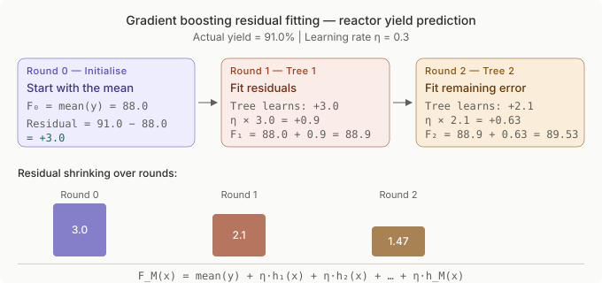
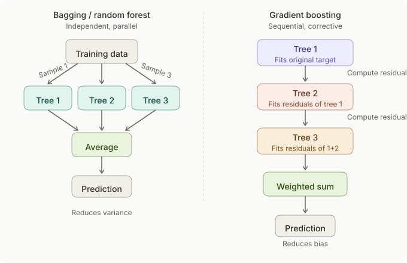
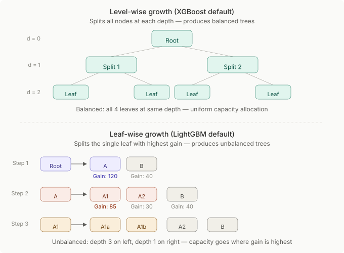
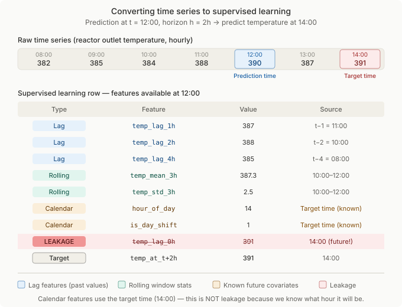
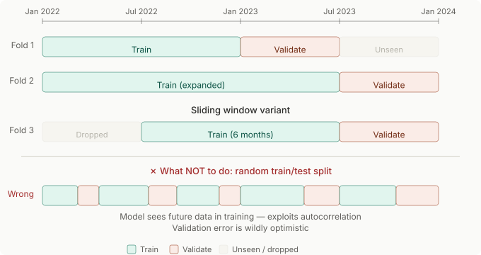

# Gradient Boosted Trees

Reference notes on tree-based models: how single trees, bagging, and gradient boosting work, what XGBoost and LightGBM each do differently, and how to frame a time-series forecasting problem so boosted trees can handle it. Written from a deep learning background, so the analogies run in that direction.

## Tree fundamentals

### Decision trees

A decision tree partitions the feature space by asking a sequence of binary questions, each on a single feature. At each internal node the algorithm picks the feature and threshold that best separates the target values, then recurses on each side. Terminal nodes (leaves) hold a prediction: the mean of all training samples that landed there (regression) or the majority class (classification).

**Key intuition.** A decision tree is a piecewise-constant function. For a reactor yield prediction task, the tree might first split on inlet temperature > 385 °C, then on catalyst age > 45 days. Each leaf represents an operating regime with a single predicted yield. Compare this to a neural network that learns a smooth function: a tree learns a step function.

**Splitting criteria.** For regression, the standard criterion is variance reduction (equivalently, minimising squared error within child nodes). For classification, Gini impurity or entropy. The algorithm evaluates every possible (feature, threshold) pair at each node and picks the one that maximises the reduction in impurity. This is an exhaustive search, expensive on wide data, but the reason trees capture non-linear interactions without feature engineering.

**Depth and prediction.** A depth-1 tree (a "stump") makes one split, essentially a single if-else rule. A depth-10 tree can capture complex interactions but memorises noise. In plant data, a deep tree might learn that "when Tag_A > 200 AND Tag_B < 50 AND it's a Tuesday AND Tag_C is between 7.31 and 7.32… then yield = 91.3" — that last condition is fitting a single data point, not a real pattern.

**Pruning.** Two strategies:
- *Pre-pruning*: stop growing early via `max_depth`, `min_samples_leaf`, `min_samples_split`. This is what you use in practice.
- *Post-pruning*: grow a full tree, then remove branches that do not improve validation performance (cost-complexity pruning). Scikit-learn supports this via `ccp_alpha`.

**Practical implications.** A single decision tree is rarely used alone in production. It is high-variance (small data changes produce very different trees) and low-bias only when deep. But understanding trees is essential because every ensemble method (bagging, random forests, gradient boosting) builds on them.

**Common failure modes.**
- Deep trees overfit aggressively on noisy sensor data. A 1000-tag historian dataset will produce a tree that memorises batch-specific artefacts.
- Trees cannot extrapolate. If training data has inlet temperatures between 350 to 400 °C, the tree's prediction for 420 °C is just the prediction of whichever leaf 400 °C falls into. There is no linear extension. This matters enormously for plant data where operators occasionally push beyond historical ranges.
- Axis-aligned splits only. A tree can only split on one feature at a time, so a diagonal decision boundary in feature space requires many splits to approximate. Neural networks handle this naturally.

### Bagging and random forests

**Bagging** (bootstrap aggregating) reduces variance by training multiple trees on different bootstrap samples (random draws with replacement from the training set), then averaging their predictions. Each tree overfits differently; the average cancels out the noise.

**Key intuition.** Think of it like ensembling in deep learning: if you trained 100 ResNets with different random seeds and averaged their outputs, you would get lower variance predictions even though each individual model might overfit. Bagging does the same thing, but instead of different initialisations, it uses different data subsets.

**Random forests** add a second source of randomness: at each split, the algorithm only considers a random subset of features (typically $\sqrt{p}$ for classification, $p/3$ for regression, where $p$ is the total number of features). This decorrelates the trees. Without this, if one feature is very strong (say, reactor temperature dominates yield prediction), every tree splits on it first and all trees look similar, defeating the purpose of averaging.

**Practical implications.**
- Random forests are embarrassingly parallel. Each tree is independent, so `n_jobs=-1` scales training linearly with cores. This matters with 1000+ tags and multi-year data.
- Out-of-bag (OOB) error: each tree never sees ~37% of the training data (the samples not drawn in its bootstrap). You can evaluate on those unseen samples to get a free validation estimate without a separate holdout set. Useful for quick iteration, but do not use it as the final evaluation, use a proper chronological split for time-series data.
- Random forests are hard to catastrophically break. With reasonable defaults (`n_estimators=500`, no depth limit or a generous one, `min_samples_leaf=5`), they perform well without tuning. This makes them an excellent baseline before moving to boosting.

**Common failure modes.**
- Random forests do not extrapolate either. The prediction is an average of leaf values, all of which are bounded by the training target range. If the plant operates at a new setpoint producing yields outside the historical range, the RF will clip its prediction.
- Slow at inference time with many trees. Each sample must traverse every tree. For real-time soft sensors (sub-second prediction), 5000-tree forests can be too slow. Boosted models typically need fewer trees for the same accuracy.
- Poor on very high-cardinality sparse features, not common in historian data but worth knowing.

### Bias and variance

Every model's prediction error on unseen data decomposes into three parts: $\text{bias}^2 + \text{variance} + \text{irreducible noise}$.

- **Bias** is the error from wrong assumptions. A linear model fitting a nonlinear yield curve has high bias. A shallow tree also has high bias, it cannot represent the complexity.
- **Variance** is the error from sensitivity to training data. A deep tree trained on 30s historian data will produce wildly different splits on different time windows: high variance.
- **Irreducible noise** is the fundamental measurement noise in sensors and lab readings. No model can reduce this.

**Key intuition.** In deep learning, you manage this tradeoff with model capacity (architecture size), dropout, weight decay, and data augmentation. In tree-based methods, the knobs are: tree depth (capacity), number of trees (averaging reduces variance), and the learning rate in boosting (controls how much each tree contributes, trading speed for variance reduction).

**Where each method sits:**
- Single deep tree: low bias, high variance.
- Single shallow tree (stump): high bias, low variance.
- Random forest: low bias (deep trees), reduced variance (averaging).
- Gradient boosting with small learning rate: low bias (many trees iteratively correct errors), low variance (each tree contributes little).

**Practical implication.** For plant data, sensor noise is significant (instrument error, discretisation, lag). You cannot eliminate irreducible noise. The job is to reduce bias (use flexible enough models) and variance (use ensembles, regularisation) without fitting the noise. The diagnostic tool is the gap between training and validation error: a large gap means high variance (overfitting); both being high means high bias (underfitting).

### Feature importance

Tree models offer multiple ways to rank features by importance. Understanding the differences matters because these are what you use to communicate with process engineers.

**Impurity-based importance** (the default in scikit-learn). For each feature, sum the total reduction in impurity (e.g., variance) across all splits that use that feature, across all trees. Fast to compute, but biased toward high-cardinality features and features with many possible split points. A sensor tag sampled at 30s with high resolution will appear more important than a daily lab reading simply because the tree has more candidate thresholds to choose from.

**Permutation importance.** After training, randomly shuffle one feature's values in the validation set and measure how much the model's performance degrades. A feature is important if shuffling it hurts predictions. This is model-agnostic and avoids the cardinality bias. Use this for reliable importance rankings.

**SHAP values** (SHapley Additive exPlanations). Assigns each feature a contribution to each individual prediction, grounded in cooperative game theory. The sum of SHAP values for a sample plus the base value equals the model's prediction for that sample. This gives both global importance (mean $|\text{SHAP}|$) and local explanations ("for this specific batch, high reactor pressure contributed +1.2% to predicted yield").

**Practical implications.**
- For explaining models to process engineers, SHAP beeswarm plots are the most effective tool. They show not just which features matter, but in which direction and at what values.
- Never use impurity-based importance alone for feature selection. It will mislead you on mixed-cadence data (30s historian vs. daily lab readings).
- Permutation importance should be computed on the validation set, not the training set. On the training set, a model may have memorised the relationship, making the importance unreliable.

**Common failure modes.**
- Correlated features split importance among themselves. If three pressure tags are highly correlated, each may appear moderately important while a single uncorrelated flow tag appears more important. SHAP handles this better than permutation importance, but not perfectly. Group correlated features before interpreting.
- Computing SHAP on 1000+ features with 100k+ samples is slow. Use `shap.TreeExplainer` (exact and fast for tree models), not `KernelExplainer`.

### Regularisation controls

Overfitting in tree models looks different from deep learning. There is no weight decay in the traditional sense, but there are equivalent controls.

**Tree-level regularisation:**
- `max_depth`: limits how many sequential splits a tree can make. Analogous to limiting network depth.
- `min_samples_leaf` / `min_child_weight` (XGBoost): requires a minimum number of samples in each leaf. Analogous to requiring a minimum batch size for a gradient update, it prevents the model from making decisions based on too few data points.
- `max_features` / `colsample_bytree`: limits how many features are considered at each split. Analogous to dropout, it forces the model not to rely on any single feature.

**Ensemble-level regularisation:**
- `n_estimators` + early stopping: more trees reduce training error but eventually overfit. Stop when validation error plateaus.
- `learning_rate` (boosting only): shrinks each tree's contribution. Smaller values need more trees but generalise better. Analogous to learning rate in SGD.
- `subsample` / `bagging_fraction`: train each tree on a random fraction of the data. Injects noise similar to mini-batch SGD.

**Practical implications.**
- The most important regularisation control in boosting is the learning rate + early stopping combination. Set the learning rate small (0.01 to 0.1), set `n_estimators` high (1000 to 10000), and let early stopping decide when to stop. This is the tree-model equivalent of training a neural network with a learning rate schedule and patience-based stopping.
- For plant data with 1000+ tags, `colsample_bytree` between 0.3 and 0.7 is important. Without it, the model will overuse a few dominant tags and miss secondary patterns.

**Common failure mode.** Tuning `max_depth` without also tuning `min_child_weight` or `min_samples_leaf`. A depth-6 tree sounds conservative, but if there is no minimum leaf size, some leaves will contain 1 or 2 samples from unusual operating conditions, and predictions for those regions will be unreliable.

## How boosting works

### Iterative error correction

Bagging builds many independent models and averages them. Boosting builds models *sequentially*, where each new model focuses on the errors of the ensemble so far.

**Key intuition.** Imagine a simple model predicting furnace outlet temperature. It gets most operating conditions right but consistently underpredicts during startup periods. A boosting approach trains the next model specifically on those residual errors, the gap between prediction and actual. The second model learns "when in startup mode, add +15 °C to the prediction." The ensemble prediction is the sum of all models.

**The deep learning analogy.** This is like functional gradient descent. In neural networks, you compute the gradient of the loss with respect to *parameters* and update the weights. In boosting, you compute the gradient of the loss with respect to the *predictions* and fit a new tree to approximate that gradient. Each tree is a step in function space.

**Residual fitting (simplified view for squared error loss):**
1. Initialise predictions: $F_0(x) = \operatorname{mean}(y)$, the best constant prediction.
2. Compute residuals: $r_i = y_i - F_0(x_i)$ for each sample.
3. Fit a small tree to the residuals. Call it $h_1(x)$.
4. Update: $F_1(x) = F_0(x) + \eta \, h_1(x)$, where $\eta$ is the learning rate.
5. Compute new residuals: $r_i = y_i - F_1(x_i)$.
6. Repeat.

After $M$ rounds: $F_M(x) = F_0(x) + \eta \sum_{m=1}^{M} h_m(x)$.

**Why this works.** Each tree only needs to explain what the current ensemble gets wrong. Early trees capture the big patterns (temperature drives yield). Later trees capture subtler effects (catalyst age interaction with feed composition). This additive structure means boosting can fit complex functions with simple base learners (shallow trees, typically depth 3 to 6).

**Practical implication.** Because trees are added sequentially, boosting is inherently sequential: you cannot parallelise across trees the way you can with a random forest. You can parallelise *within* each tree (evaluating split candidates), but not across trees. This makes boosting slower to train than random forests on the same hardware.

### Gradient boosting mechanics

The generalisation from residual fitting to *gradient* boosting is what makes the framework powerful: it works with any differentiable loss function.

**The general algorithm:**
1. Choose a loss function $L(y, F(x))$: squared error, absolute error, Huber, quantile, log-loss, etc.
2. Initialise $F_0(x)$ to minimise the total loss (for squared error, this is the mean; for absolute error, the median).
3. For $m = 1, 2, \ldots, M$:
   - Compute the negative gradient of the loss with respect to the current prediction for each sample: $g_i = -\frac{\partial L(y_i, F_{m-1}(x_i))}{\partial F_{m-1}(x_i)}$. These are the "pseudo-residuals."
   - Fit a regression tree $h_m(x)$ to these pseudo-residuals.
   - Update: $F_m(x) = F_{m-1}(x) + \eta \, h_m(x)$.

For squared error loss, the negative gradient is simply $(y_i - F(x_i))$, which is the residual, so "residual fitting" is a special case.

**Why the loss function matters for plant data.** Squared error penalises large errors heavily. If furnace data has occasional temperature excursions (outliers from sensor glitches or upsets), the model will waste capacity fitting those outliers. Huber loss or MAE is more robust. Quantile loss lets you predict the 90th percentile of yield, useful for setting conservative production targets.

**The four key hyperparameters:**
- **Learning rate ($\eta$):** 0.01 to 0.3 typically. Smaller means more trees needed but better generalisation. This is the single most important hyperparameter.
- **Number of estimators ($M$):** Controlled by early stopping. Set high and let validation loss determine the cutoff.
- **Tree depth:** 3 to 8 for most problems. Deeper trees capture higher-order interactions but overfit faster. Depth 6 means the tree can represent up to 6-way feature interactions.
- **Subsampling (`subsample`):** Training each tree on a random 50 to 80% of the data adds stochastic regularisation. Called "stochastic gradient boosting."

**Practical implication.** The learning rate and number of trees are coupled. Halving the learning rate roughly doubles the number of trees needed to reach the same training loss, but often improves test performance. The standard practice is: set learning rate to 0.05 or 0.1, set `n_estimators` to 5000 to 10000, use early stopping with patience of 50 to 100 rounds.

**Common failure mode.** Setting a high learning rate (0.3) with many trees. The model overshoots early, oscillates, and overfits. If validation loss decreases then increases sharply, the learning rate is too high.

### Early stopping

Early stopping in gradient boosting works the same way as in neural network training: monitor validation loss after each round (tree) and stop when it has not improved for a set number of rounds (patience).

**Key intuition.** Each tree added reduces training loss monotonically (or nearly so). Validation loss decreases initially, flattens, then increases as the model overfits. The optimal number of trees is where validation loss is minimised. Early stopping finds this automatically.

**Implementation:**
- Pass an evaluation set (must be chronologically after training data for time series).
- Set `early_stopping_rounds` (XGBoost) or `callbacks=[lgb.early_stopping(stopping_rounds=50)]` (LightGBM).
- The model stores the best iteration and uses it for prediction.

**Practical implications.**
- Early stopping replaces manual tuning of `n_estimators`. Set it high and let the algorithm decide.
- The patience parameter matters. With noisy plant data, validation loss can fluctuate. A patience of 50 rounds with a 0.05 learning rate means the model continues for 50 more trees after the best score, tolerating local fluctuations. Too small a patience stops prematurely.
- Always use the model from the best iteration, not the final iteration. Both XGBoost and LightGBM support this via `best_iteration`.

### Boosting vs bagging

| Dimension | Random Forest | Gradient Boosting |
|-----------|---------------|-------------------|
| Construction | Parallel, independent trees | Sequential, corrective trees |
| Tree depth | Typically deep (unlimited) | Typically shallow (3 to 8) |
| Bias-variance | Reduces variance via averaging | Reduces bias via iterative correction |
| Overfitting risk | Hard to overfit with more trees | Easy to overfit with too many trees |
| Tuning burden | Low, works well with defaults | Moderate: learning rate, depth, regularisation |
| Training speed | Parallelisable across trees | Sequential across trees (parallel within tree) |
| Inference speed | Slow with many trees | Faster (fewer, shallower trees) |
| Extrapolation | Cannot | Cannot |

**When to use which in plant applications:**
- **Random forest** for a quick baseline, for feature importance screening on a new dataset, or when there is limited time to tune. Also prefer RF when the dataset is small and you cannot afford to overfit.
- **Gradient boosting** when you need maximum predictive accuracy for a production model, when there is enough data for a proper validation set, and when you can invest time in tuning.

**Practical implication.** Always train a random forest first. It gives a reliable baseline, fast feature importance, and a sense of what accuracy is achievable. Then switch to XGBoost or LightGBM and aim to beat the RF. If you cannot beat it, something is wrong with the boosting setup (leakage, bad hyperparameters, or the data simply does not benefit from sequential correction).

## XGBoost

### The regularised objective

XGBoost's key innovation over vanilla gradient boosting is an explicit regularised objective function that is optimised directly.

At each step $m$, XGBoost minimises:

$$
\mathrm{Obj} = \sum_i L\bigl(y_i,\, F_{m-1}(x_i) + h_m(x_i)\bigr) + \Omega(h_m)
$$

where $\Omega$ is a regularisation term on the new tree:

$$
\Omega(h) = \gamma T + \tfrac{1}{2}\lambda \sum_j w_j^2
$$

- $T$ is the number of leaves in the tree.
- $w_j$ is the prediction value (weight) of leaf $j$.
- $\gamma$ penalises tree complexity (more leaves = higher penalty). Analogous to an L0 penalty on the number of active neurons.
- $\lambda$ penalises large leaf weights. Analogous to L2 weight decay in neural networks.

**Key intuition.** Vanilla gradient boosting just fits trees to pseudo-residuals and hopes regularisation comes from small learning rates and early stopping. XGBoost bakes regularisation into the split decision itself. A split is only made if the gain exceeds $\gamma$. A leaf's weight is shrunk toward zero by $\lambda$. This means XGBoost's trees are structurally different from scikit-learn's gradient boosting trees.

**Practical implication.** The $\gamma$ parameter (`min_split_loss` in XGBoost, `gamma` in the API) acts as a pruning threshold. Increasing $\gamma$ makes the model require larger improvements to justify a split, producing simpler trees. For noisy sensor data, a non-zero $\gamma$ (e.g., 0.1 to 1.0) prevents the model from making splits that explain tiny amounts of variance, splits that are likely fitting noise.

### Second-order gradients (Newton's method)

This is the mathematical core of what makes XGBoost faster to converge than vanilla gradient boosting.

Vanilla gradient boosting uses only the first derivative (gradient) of the loss function. XGBoost uses both the first derivative ($g_i$) and the second derivative (Hessian, $h_i$):

$$
g_i = \frac{\partial L(y_i, \hat{y}_i)}{\partial \hat{y}_i} \qquad \text{(gradient)}
$$

$$
h_i = \frac{\partial^2 L(y_i, \hat{y}_i)}{\partial \hat{y}_i^2} \qquad \text{(Hessian)}
$$

The optimal weight for leaf $j$ is:

$$
w_j^\star = -\frac{\sum_{i \in \text{leaf } j} g_i}{\sum_{i \in \text{leaf } j} h_i + \lambda}
$$

**Key intuition.** The deep learning analogy is exact: this is Newton's method vs standard gradient descent. First-order methods (SGD) use only the gradient to choose the direction. Second-order methods (Newton's method) use the curvature (Hessian) to choose both direction and step size. The Hessian tells you how "confident" the gradient signal is. If the loss surface is flat (small Hessian), the model should take a cautious step. If it's steep (large Hessian), the gradient signal is reliable.

For squared error loss: $g_i = \hat{y}_i - y_i$, $h_i = 1$ (constant). So for MSE, the second-order information does not add much. The benefit appears with other loss functions (log-loss, quantile loss) where the curvature varies across the prediction space.

**Practical implication.** This is why XGBoost converges in fewer boosting rounds than vanilla gradient boosting for the same accuracy: each tree makes a better-calibrated step. There is nothing to tune here, it happens automatically. But it explains why XGBoost is faster to train than a naive implementation.

### Split gain

When XGBoost evaluates whether to split a node, it computes the *gain* of the split:

$$
\text{Gain} = \tfrac{1}{2}\left[
\frac{(\sum g_L)^2}{\sum h_L + \lambda}
+ \frac{(\sum g_R)^2}{\sum h_R + \lambda}
- \frac{(\sum g_P)^2}{\sum h_P + \lambda}
\right] - \gamma
$$

Where $L$ = left child, $R$ = right child, $P$ = parent (before split). The subscript sums are over the gradient and Hessian values of samples in each node.

**Key intuition.** This formula directly answers: "Is this split worth it?" The first three terms measure how much better two children explain the gradients than the parent alone. The $\gamma$ term is the cost of adding a split. If $\text{Gain} \le 0$, the split is not made, the node remains a leaf. This is built-in pre-pruning, not an afterthought.

**Why this matters for plant data.** With 1000+ features, the algorithm evaluates thousands of candidate splits per node. Many will have tiny positive gains: they explain a fraction of the residual variance that is likely noise. The $\gamma$ penalty filters these out at split time, producing cleaner trees than scikit-learn's gradient boosting (which does not have this mechanism by default).

**Practical implication.** When tuning XGBoost, $\gamma$ and $\lambda$ together control model complexity. Start with $\gamma = 0$, $\lambda = 1$ (defaults). If the model overfits, increase $\gamma$ to 0.1 to 5.0 and $\lambda$ to 1 to 10. For regression on noisy data, these two parameters are often more effective than reducing tree depth.

### Built-in missing value handling

XGBoost natively handles missing values during both training and inference without imputation.

**How it works.** At each split, the algorithm tries sending all samples with a missing value for that feature to the left child, then to the right child, and picks whichever direction gives a higher gain. This "default direction" is stored with the split. At inference time, if a value is missing, the sample follows the learned default direction.

**Key intuition.** This is better than imputation for plant data because missingness is often informative. A sensor that goes offline may indicate a shutdown, a calibration event, or a fault. Imputing with the mean destroys that signal. XGBoost's approach lets the model learn that "missing Tag_A values tend to correlate with lower yield" without explicitly encoding this.

**Practical implications.**
- You can (and should) feed raw data with NaNs to XGBoost. Do not impute unless there is a domain reason.
- LightGBM handles missing values the same way. Scikit-learn's `GradientBoostingRegressor` does not, it requires imputation or will raise an error.
- If a sensor has a "bad value" placeholder (e.g., $-9999$ or 0 when the true range is 50 to 200), replace those with NaN before training so that XGBoost's missing value logic handles them correctly. Otherwise the model will learn splits on $-9999$ as if it were a real reading.

**Common failure mode.** Blindly imputing with mean/median before feeding data to XGBoost. You lose the informative missingness signal and may introduce bias (e.g., imputing a temperature with the global mean when the sensor was down during a shutdown, where the true temperature was likely ambient, not the mean operating temperature).

### Hyperparameters and tuning order

Rather than tuning all parameters simultaneously, use a staged approach.

**Tier 1, set first, most impact:**
- `learning_rate` ($\eta$ / `eta`): Start with 0.05. Range: 0.01 to 0.3.
- `n_estimators`: Set to 5000 to 10000. Let early stopping decide.
- `max_depth`: Start with 6. Range: 3 to 10. Controls the maximum interaction order.
- `early_stopping_rounds`: 50 to 100.

**Tier 2, tune second, regularisation:**
- `min_child_weight`: Minimum sum of instance weight (hessian) in a leaf. Start with 1. Increase to 5 to 100 for noisy data. For MSE loss, this equals the minimum number of samples in a leaf.
- `subsample`: Fraction of training data per tree. Start with 0.8. Range: 0.5 to 1.0.
- `colsample_bytree`: Fraction of features per tree. Start with 0.8. Range: 0.3 to 1.0.
- `gamma`: Minimum split gain. Start with 0. Increase if overfitting.
- `reg_lambda` ($\lambda$): L2 regularisation. Start with 1. Range: 0 to 10.
- `reg_alpha` ($\alpha$): L1 regularisation on leaf weights. Useful for sparse feature spaces. Start with 0.

**Tier 3, rarely changed:**
- `max_leaves`: Alternative to `max_depth` for controlling tree size.
- `colsample_bylevel`, `colsample_bynode`: Finer-grained feature sampling.
- `scale_pos_weight`: For imbalanced classification only.

**Tuning workflow:**
1. Fix `learning_rate = 0.05`, `max_depth = 6`, defaults for everything else. Train with early stopping. Note the best number of rounds and validation score.
2. Do a coarse grid or Bayesian search over `max_depth` (3 to 8), `min_child_weight` (1, 5, 10, 50), `subsample` (0.6, 0.8, 1.0), `colsample_bytree` (0.5, 0.7, 1.0).
3. Fine-tune `gamma` and `reg_lambda` if still overfitting.
4. Optionally reduce `learning_rate` to 0.01 and retrain with more rounds for the final model.

**Common failure modes.**
- Tuning `n_estimators` directly instead of using early stopping. Never manually fix the number of trees.
- Overfitting `max_depth` because it is the most visible knob. Depth 10+ rarely helps and usually hurts unless the data is very large and there are many meaningful interactions.
- Neglecting `colsample_bytree` on wide datasets. With 1000+ tags, forcing the model to work with a random subset at each tree is critical for generalisation.

### Failure modes on process data

1. **Overfitting to sensor noise.** 30-second historian data is noisy. A model trained on raw data with depth 10 and no regularisation will memorise transients. Downsample or aggregate to a meaningful cadence (1 min, 5 min) and use regularisation.

2. **Data leakage from future features.** If the feature matrix includes values that would not be available at prediction time (e.g., a lab reading that arrives 4 hours after the event being predicted), the model will appear excellent in training but fail in production. Boosted trees exploit leakage aggressively because they are powerful enough to pick up on even subtle future information.

3. **Target leakage from correlated tags.** If predicting yield at the plant outlet and one of the features is a downstream flow measurement that is itself derived from yield, that is leakage. The model will learn to use that feature, and SHAP will show it as the top feature, a red flag.

4. **Training on shutdown/startup data.** Plant data during shutdowns and startups is fundamentally different from steady-state operation. Mixing them in training makes the model learn an average that is good at neither. Filter or segment by operating regime.

5. **Ignoring the no-extrapolation limitation.** If the model was trained on data from 2019 to 2023 and the plant then installs a new catalyst with higher activity, all features related to that catalyst behave differently. The model cannot extrapolate and will produce unreliable predictions until retrained.

## LightGBM

### Histogram-based splitting

In standard (exact) gradient boosting, the algorithm evaluates every unique value of every feature as a candidate split point. With millions of rows and thousands of features, this is expensive.

LightGBM bins continuous features into a fixed number of discrete bins (default 255) before training. Instead of evaluating every unique value, it evaluates only the bin boundaries.

**Key intuition.** Think of it as quantisation. Instead of working with raw 32-bit floating point values, you work with 8-bit buckets. You lose some precision on where exactly to split, but you gain enormous speed: the histogram for each feature can be built in a single pass through the data, and subtraction (parent histogram minus left child histogram = right child histogram) halves the work further.

**Practical implications.**
- Training is 5 to 20x faster than exact methods on large datasets. For a multi-year historian dataset with millions of rows, this is the difference between a 2-hour training run and a 10-minute one.
- The accuracy loss from binning is negligible in practice. With 255 bins, the approximation error is smaller than the noise in most sensor data.
- XGBoost also supports histogram-based splitting (`tree_method='hist'`), but LightGBM was designed around it from the ground up and is generally faster.
- The `max_bin` parameter controls the number of bins. Default 255 is almost always sufficient. Increasing it increases precision but slows training.

### Leaf-wise vs level-wise growth

This is the most important architectural difference between LightGBM and XGBoost.

**Level-wise (XGBoost default):** The tree grows one full level at a time. All nodes at depth $d$ are split before moving to depth $d+1$. This produces balanced trees. Every leaf is at the same depth.

**Leaf-wise (LightGBM default):** The algorithm picks the leaf with the highest gain across the entire tree and splits that one leaf, regardless of depth. This produces unbalanced trees. Some branches go deep where the data has complex patterns; other branches stay shallow where the data is simple.

**Key intuition.** Level-wise growth is like training all layers of a neural network with the same width. Leaf-wise growth is like allocating more capacity where the loss is highest, focusing the model's complexity budget where it matters most. For plant data, this means the tree might go 15 levels deep on a specific operating regime where yield behaviour is complex, while staying 3 levels deep on normal steady-state operation.

**Practical implications.**
- Leaf-wise growth achieves lower loss with fewer leaves. LightGBM often needs fewer boosting rounds to reach the same accuracy as XGBoost.
- Leaf-wise growth overfits faster. Because it aggressively pursues the highest-gain splits, it can fit noise more quickly. This is the core tradeoff.
- In LightGBM, tree size is controlled primarily via `num_leaves` (max number of leaves), not `max_depth`. The default `num_leaves = 31` corresponds roughly to a balanced tree of depth 5 ($2^5 = 32$ leaves). But since the tree is unbalanced, some paths may be much deeper than 5.
- `max_depth` in LightGBM is a secondary constraint (default $-1$ = no limit). Set it to prevent pathologically deep branches, e.g., `max_depth = 10`.

### `num_leaves` and `min_data_in_leaf`

These are the two most important hyperparameters in LightGBM and the primary tools for controlling overfitting.

**`num_leaves`** (default 31): Maximum number of leaves per tree. This is the main capacity control. Unlike `max_depth` in XGBoost (which limits depth uniformly), `num_leaves` limits total tree complexity while allowing variable depth.

- Too high → overfitting (the tree is too complex).
- Too low → underfitting (the tree cannot capture interactions).
- Rule of thumb: `num_leaves` should be less than $2^{\text{max\_depth}}$ if you also set `max_depth`. For most problems, 15 to 127.

**`min_data_in_leaf`** (default 20): Minimum number of samples required in each leaf. This is LightGBM's equivalent of `min_child_weight` in XGBoost (when using MSE loss).

- Too low → leaves with few samples, predictions based on noise.
- Too high → cannot capture minority patterns (e.g., a specific rare operating regime).
- For large datasets (100k+ rows), values of 50 to 500 work well. For small datasets (1k to 10k), use 5 to 20.

**Key intuition.** `num_leaves` controls the tree's maximum expressiveness. `min_data_in_leaf` controls the minimum statistical support for any prediction. You need both. A tree with `num_leaves=127` but `min_data_in_leaf=100` is powerful yet stable. A tree with `num_leaves=127` and `min_data_in_leaf=1` is a recipe for overfitting.

**Practical implication.** When moving from XGBoost to LightGBM, do not just translate `max_depth` to `num_leaves = 2^{\text{max\_depth}}`. Start with `num_leaves=31`, `min_data_in_leaf=20`, and adjust from there. The tuning dynamics are different.

### GOSS and EFB

These are two algorithmic optimisations that give LightGBM additional speed on large datasets. Understanding them conceptually is sufficient.

**GOSS (Gradient-based One-Side Sampling).** Instead of using all training samples to compute the histogram at each split, GOSS keeps all samples with large gradients (high residuals, the "hard" examples) and randomly samples from the rest. The rationale: samples with small gradients are already well-predicted, so they contribute less to the split decision.

- Deep learning analogy: this is like hard example mining or focal loss, spending more compute on the samples the model gets wrong.
- In practice, controlled by `top_rate` (fraction of large-gradient samples to keep, default 0.2) and `other_rate` (sampling rate for the rest, default 0.1). These defaults are aggressive. Using `boosting_type='goss'` enables it.
- Downside: GOSS introduces noise in gradient estimates, which can hurt when all samples carry useful signal (e.g., stable steady-state operation where residuals are small but meaningful).

**EFB (Exclusive Feature Bundling).** When features are mutually exclusive (rarely nonzero at the same time), EFB bundles them into a single feature. This reduces the effective number of features the algorithm must process.

- Useful for one-hot encoded categoricals or sparse features. Less relevant for dense historian data where all tags are continuously valued.
- Happens automatically; there is nothing to configure.

**Practical implication.** On dense historian data with 1000+ continuous tags, EFB will have minimal effect. GOSS can speed up training but may not improve accuracy. The default `boosting_type='gbdt'` (standard gradient boosting) is usually the best choice. Switch to GOSS only if training time is a bottleneck and accuracy has been verified as not degraded on the validation set.

### Categorical features

LightGBM can handle categorical features natively, without one-hot encoding.

**How it works.** For each categorical feature at each split, LightGBM finds the optimal partition of categories into two groups. It does this efficiently by sorting categories by their gradient statistics (within each category: $\sum_i g_i \big/ \sum_i h_i$) and then evaluating splits along this sorted order, reducing the problem from exponential (all possible subsets) to linear (all contiguous subsets along the sorted order).

**Why this matters for plant data.** Typical categorical features include operating mode (normal / startup / shutdown / turndown), catalyst batch ID, shift (day / night), feed source (crude A / crude B). One-hot encoding creates sparse features that trees split on inefficiently. Native categorical handling lets the tree find "catalyst batches {B, D, F} behave differently from {A, C, E}" in a single split rather than requiring multiple splits.

**Practical implications.**
- Declare categoricals explicitly: `lgb.Dataset(X, y, categorical_feature=['op_mode', 'catalyst_id'])`.
- Do not one-hot encode features meant for LightGBM's native handling. It defeats the purpose.
- XGBoost added experimental categorical support in version 1.6, but it is less mature than LightGBM's. If categoricals are important, prefer LightGBM.
- High-cardinality categoricals (e.g., individual batch IDs with hundreds of unique values) can still overfit. Use `min_data_per_group` (default 100) and `cat_smooth` (default 10) to regularise.

### Why LightGBM overfits quickly, and how to control it

LightGBM's leaf-wise growth strategy is more aggressive than XGBoost's level-wise growth. Combined with histogram approximation (which speeds up training enough to allow many more rounds), LightGBM can overfit before you notice.

**Signs of overfitting:**
- Training RMSE continues to drop while validation RMSE plateaus or increases.
- SHAP importance shows many features with small but nonzero importance: the model is using everything, including noise.
- The model performs well on steady-state data but poorly on regime transitions.

**Controls (in order of importance):**
1. `num_leaves`: Reduce from 31 to 15 or 7.
2. `min_data_in_leaf`: Increase from 20 to somewhere in 50 to 200.
3. `learning_rate`: Reduce to 0.01 to 0.05 and let early stopping run longer.
4. `feature_fraction` (= `colsample_bytree`): 0.5 to 0.8.
5. `bagging_fraction` + `bagging_freq`: Subsample 60 to 80% of data every 1 to 5 rounds.
6. `lambda_l1`, `lambda_l2`: L1/L2 regularisation on leaf weights. Start with 0, increase to 0.1 to 10.
7. `min_gain_to_split` (same role as $\gamma$ in XGBoost): 0.01 to 1.0.
8. `max_depth`: Set as a safety net, e.g., 8 to 12, even though `num_leaves` is the primary control.

**Practical implication.** The biggest mistake when switching from XGBoost to LightGBM is underestimating how much regularisation is needed. LightGBM's defaults are tuned for speed and low training error, not for generalisation on noisy data. For industrial historian data, start conservative: `num_leaves=15`, `min_data_in_leaf=100`, `learning_rate=0.05`, and open up capacity only if the model underfits.

## XGBoost vs LightGBM in practice

| Dimension | XGBoost | LightGBM |
|-----------|---------|----------|
| Tree growth | Level-wise (default) | Leaf-wise (default) |
| Complexity control | `max_depth` | `num_leaves` + `min_data_in_leaf` |
| Speed | Fast (with `tree_method='hist'`) | Faster (native histogram design) |
| Categoricals | Experimental support | Mature native support |
| Missing values | Native handling | Native handling |
| Default overfitting risk | Moderate | Higher (needs more regularisation) |
| API style | `xgb.train()` with DMatrix | `lgb.train()` with Dataset |
| GPU support | Good | Good |
| Community/production | Extremely mature, widely deployed | Mature, widely deployed, growing |

**When to prefer XGBoost:** When you want a more conservative default, when the team is already using XGBoost in production, when categorical features are not important.

**When to prefer LightGBM:** When training speed matters (large datasets), when there are important categorical features, when more aggressive regularisation tuning is acceptable.

**Practical implication.** On industrial process data, try both. Train an XGBoost model and a LightGBM model with equivalent tuning effort. Pick whichever generalises better on walk-forward validation. The difference in final accuracy is often $<1\%$, and the choice often comes down to team familiarity and training speed.

## Time series with boosted trees

### Framing a forecast as supervised learning

Boosted trees do not natively understand time. They see a matrix of rows (samples) and columns (features), with no notion of sequence. To use them for time-series forecasting, the problem must be converted into a tabular supervised learning format.

**The core transformation:** For each timestamp $t$ at which you want to make a prediction, construct a feature row using only information available at or before $t$, and assign the target $y(t)$ or $y(t+h)$, where $h$ is the forecast horizon.

**Feature categories:**

*Lag features.* The value of a variable at previous time steps. If predicting yield at time $t$, features might include $y(t-1)$, $y(t-2)$, $y(t-24\,\mathrm{h})$. These give the model access to recent history.

*Rolling/window features.* Summary statistics over a trailing window: mean, std, min, max over the last 1 hour, 4 hours, 24 hours. These capture trends and volatility. For a reactor temperature tag, `temp_rolling_mean_1h` smooths out noise, while `temp_rolling_std_1h` captures instability.

*Expanding features.* Statistics computed from the start of a run or campaign up to time $t$. For example, cumulative catalyst hours, cumulative feed processed. These capture long-term degradation effects.

*Calendar/cyclical features.* Hour of day, day of week, month. In a plant, these capture shift changes, weekend effects, seasonal ambient temperature differences. Encode cyclical features with sin/cos transforms or as categoricals.

*Known future covariates.* Variables whose future values are known at prediction time: scheduled setpoints, planned production targets, weather forecasts, planned maintenance windows. These are features, not targets, and their future values are usable because they are deterministic or forecasted independently.

**Key intuition.** This is analogous to preparing data for a causal (autoregressive) language model: the model only sees tokens to the left of the current position. Here, the model only sees data at or before time $t$. Any feature that uses data from after $t$ is leakage.

**Common failure mode.** Using pandas `rolling()` without setting `closed='left'` or shifting properly. The default rolling window in pandas includes the current row, which is correct for features like `temperature_rolling_mean_1h` (the mean temperature over the past hour up to now). But if the target is the value at time $t$ and you compute `target_rolling_mean_1h` including time $t$, the target has leaked into the features.

### Forecast horizon and known future covariates

The **forecast horizon** $h$ is how far ahead you are predicting. This choice fundamentally shapes feature engineering and model design.

**Direct forecasting:** Train a separate model for each horizon. $\text{Model}_1$ predicts $y(t+1)$, $\text{Model}_6$ predicts $y(t+6)$. Each model's features use only data available at time $t$. Simple, but requires $N$ models for $N$ horizons.

**Recursive forecasting:** Train one model to predict $y(t+1)$. For $y(t+2)$, use the model's own prediction of $y(t+1)$ as a feature. Errors compound: the prediction for $y(t+6)$ uses five layers of imperfect predictions. Generally not recommended for boosted trees because trees cannot extrapolate, so errors accumulate into unreliable regions.

**Direct multi-output:** Train one model that predicts a vector $[y(t+1), y(t+2), \ldots, y(t+h)]$ simultaneously. XGBoost and LightGBM do not natively support this (they predict scalars), so this needs separate models or a wrapper. In practice, direct single-horizon models are the standard approach.

**Known future covariates.** Some variables have known future values at prediction time:
- Planned setpoints (the operator schedule for the next shift is published in advance).
- Weather forecasts (ambient temperature for the next 24 hours).
- Calendar features (we know what hour/day it will be).
- Maintenance schedules.

Include these as features, using their values at the *target* time, not the *prediction* time. For example, if predicting yield at $t + 6\,\mathrm{h}$ and the planned reactor temperature setpoint for $t + 6\,\mathrm{h}$ is known, include it as a feature. This is not leakage, it is information you genuinely have.

**Key intuition.** The question to ask for every feature is: "At the moment I need to make this prediction, do I have this value?" If yes, it is a valid feature. If no, it is leakage (or it needs to be itself forecasted).

### Chronological splits and walk-forward validation

**Critical rule: never use random train/test splits for time-series data.**

Random splits allow the model to see future data in training and evaluate on past data in testing. The model can exploit autocorrelation (the past looks like the nearby future) and any temporal leakage, giving wildly optimistic error estimates.

**Chronological split:** Training data = all data before time $T_1$. Validation data = all data from $T_1$ to $T_2$. Test data = all data after $T_2$. The model never sees future data during training.

**Walk-forward validation** (expanding window or sliding window):
1. Train on data from $t_0$ to $T_1$. Validate on $T_1$ to $T_1+\Delta$.
2. Train on data from $t_0$ to $T_1+\Delta$. Validate on $T_1+\Delta$ to $T_1+2\Delta$.
3. Repeat.

Each fold uses a strictly later period for validation. The final metric is the average across all folds.

**Expanding window** keeps all historical data in the training set. **Sliding window** drops old data (e.g., always train on the most recent 6 months). Sliding windows are better when the process changes over time (catalyst degradation, equipment replacement) and old data may be misleading.

**Practical implications.**
- For plant data with regime changes, walk-forward with a sliding window is the most realistic evaluation. It answers: "How well does the model perform when retrained monthly on the last 6 months of data?"
- The validation period should cover at least one full cycle of any periodicity in the data. If there are seasonal effects, each fold should include enough time to capture them. For 30s historian data, a validation window of 1 to 4 weeks is typical.
- With only 1 year of data, a simple chronological 70/15/15 split is more practical than walk-forward (too few folds).

**Common failure mode.** Using scikit-learn's `cross_val_score` with default KFold. This shuffles data and creates random splits. Use `TimeSeriesSplit` from scikit-learn, or implement walk-forward manually.

### Leakage detection

Leakage is the most dangerous failure mode in time-series ML for plant data. The model looks excellent in validation but fails in production. Types of leakage:

**Direct target leakage.** A feature that is computed from or is a direct proxy for the target variable. Example: including the outlet product quality analyser reading as a feature when predicting product quality. This is obvious but becomes subtle with 1000+ tags where some downstream measurements are indirect functions of the target.

**Temporal leakage.** A feature that uses information from after the prediction time. Examples:
- A rolling average that includes future values (wrong window alignment).
- A lab reading timestamped at 8 AM that actually reflects a sample taken at 6 AM and analysed by 8 AM, but the model uses it to predict 7 AM yield.
- An event flag (shutdown = True) that is coded retrospectively. At the time of prediction, you might not yet know that a shutdown has begun.

**Train/test leakage.** Information from the test set that leaks into training. Example: normalising features using the global mean/std (including test data) rather than using only training-set statistics.

**Detection strategies:**
1. **Suspiciously high accuracy.** If the model achieves $R^2 > 0.98$ on what should be a noisy industrial process, suspect leakage before celebrating.
2. **Feature importance analysis.** If SHAP shows a single feature dominating with unreasonably high importance, investigate whether it is a proxy for the target or uses future information.
3. **Ablation testing.** Remove the top feature and retrain. If performance drops dramatically, that feature may be leaking. If performance drops only modestly, the model has redundant information and is likely sound.
4. **Production simulation.** Build the feature engineering pipeline exactly as it would run in production (only using data available at prediction time) and compare performance to the offline evaluation. A large gap means the offline pipeline had leakage.

**Practical implication.** The single best defence against leakage is to implement a `make_features(timestamp)` function that takes a prediction time and returns a feature vector using only data available at that time. Use this same function for both training and inference. If the training pipeline and inference pipeline use different code paths, leakage is almost guaranteed.

### Baselines

Never evaluate a model in isolation. Always compare against baselines that establish what accuracy is "free" before any machine learning.

**Naive baseline:** Predict $y(t+h) = y(t)$. The forecast is just the last known value. For slow-moving processes (yield changes over hours), this is surprisingly hard to beat at short horizons.

**Seasonal naive:** Predict $y(t+h) = y(t - L + h)$ where $L$ is the seasonal period (e.g. 24 hours). If yield has a 24-hour cycle (day vs night shifts), the seasonal naive uses yesterday's value at the same hour. This captures periodic patterns with zero ML.

**Linear baseline:** Train a simple linear regression on the same features. This establishes how much of the predictable signal is linear vs nonlinear. If the linear model achieves $R^2 = 0.85$ and the boosted model achieves $R^2 = 0.87$, the trees are adding marginal value and the added complexity is questionable.

**Random forest baseline:** RF with defaults is a strong, low-effort baseline for nonlinear models. If XGBoost/LightGBM cannot beat it, something is misconfigured.

**Practical implication.** Report all baselines alongside the model. For a refinery yield model, the table might be:

| Model | Validation RMSE | vs Naive |
|-------|----------------|----------|
| Naive (last value) | 2.1 | — |
| Seasonal naive (24h) | 1.8 | −14% |
| Linear regression | 1.3 | −38% |
| Random forest | 0.95 | −55% |
| LightGBM (tuned) | 0.88 | −58% |

This tells the story: most of the value comes from using any model; the gap between RF and LightGBM is small; the model is adding real signal beyond naive approaches.

### Metrics that map to business value

Standard ML metrics (RMSE, MAE, $R^2$) do not directly tell you whether the model is useful for plant operations. Choose metrics that connect to the decision being made.

**RMSE (Root Mean Squared Error).** Penalises large errors heavily. Good when large mispredictions are operationally costly (e.g., predicting furnace temperature, where a $20^\circ\mathrm{C}$ error is much worse than $4\times$ a $5^\circ\mathrm{C}$ error).

**MAE (Mean Absolute Error).** Treats all errors proportionally. Better when average performance is what matters and outlier errors are not catastrophically worse (e.g., daily production volume forecasting).

**MAPE (Mean Absolute Percentage Error).** Interpretable to business stakeholders ("the model is off by 3% on average"). But fails when the target is near zero (division by zero/infinity) and biases toward underestimation. Use with caution.

**Quantile loss.** If the business decision is about risk management (e.g., "what is the minimum yield we can guarantee with 90% confidence?"), use quantile regression to predict the 10th percentile. The quantile loss function directly optimises for this.

**Direction accuracy.** For some applications, getting the direction right matters more than the magnitude. "Will yield go up or down in the next 4 hours?" can be evaluated separately from the magnitude of the prediction.

**Domain-specific metrics.** Work with process engineers to define what matters:
- Percentage of time the prediction is within ±1% of actual yield.
- Number of false alarms (predicted upset that did not occur) vs missed alarms.
- Economic value: if the model's prediction is used to adjust a setpoint, what is the dollar value of the improved yield?

**Practical implication.** Always include at least one business-interpretable metric alongside RMSE. "RMSE = 0.88" means nothing to a plant manager. "The model predicts yield within ±1.5% for 90% of hours" is actionable.

## Quick reference

### XGBoost hyperparameters

| Parameter | Default | Typical Range | Effect |
|-----------|---------|---------------|--------|
| `learning_rate` ($\eta$, `eta`) | 0.3 | 0.01-0.1 | Shrinks each tree's contribution |
| `max_depth` | 6 | 3-10 | Max interaction order |
| `min_child_weight` | 1 | 1-100 | Min samples (hessian) per leaf |
| `subsample` | 1 | 0.5-0.9 | Row sampling per tree |
| `colsample_bytree` | 1 | 0.3-0.8 | Feature sampling per tree |
| `gamma` ($\gamma$) | 0 | 0-5 | Min split gain |
| `reg_lambda` ($\lambda$) | 1 | 0-10 | L2 on leaf weights |
| `reg_alpha` ($\alpha$) | 0 | 0-10 | L1 on leaf weights |

### LightGBM hyperparameters

| Parameter | Default | Typical Range | Effect |
|-----------|---------|---------------|--------|
| `learning_rate` ($\eta$) | 0.1 | 0.01-0.1 | Shrinks each tree's contribution |
| `num_leaves` | 31 | 7-127 | Max leaves per tree (main capacity) |
| `min_data_in_leaf` | 20 | 20-500 | Min samples per leaf |
| `feature_fraction` | 1 | 0.5-0.8 | Feature sampling per tree |
| `bagging_fraction` | 1 | 0.6-0.9 | Row sampling per tree |
| `bagging_freq` | 0 | 1-5 | How often to subsample |
| `lambda_l1` | 0 | 0-10 | L1 on leaf weights |
| `lambda_l2` | 0 | 0-10 | L2 on leaf weights |
| `min_gain_to_split` | 0 | 0-1 | Min split gain (like $\gamma$ in XGBoost) |
| `max_depth` | $-1$ | $-1$ or 8-15 | Depth safety net |
