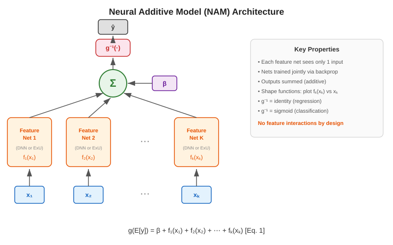
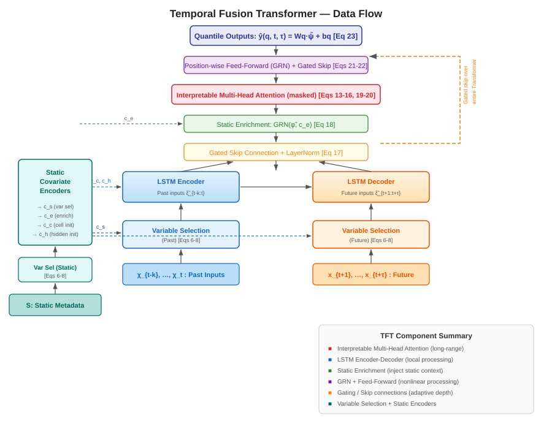
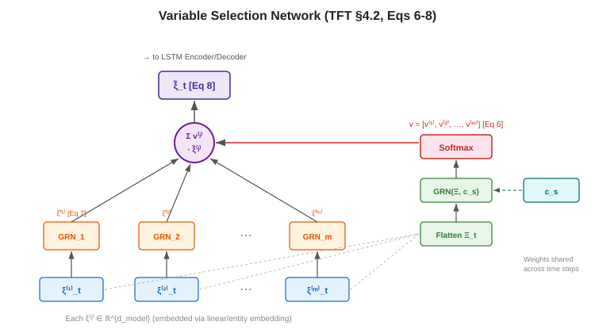

# Neural Additive Models

Reference notes on the additive-model family: classical GAMs, Neural Additive Models (NAMs), and Temporal Fusion Transformers (TFT). Aimed at someone with a deep-learning background who needs interpretable models for tabular and industrial time-series data, and wants the mechanisms and the maths in one place rather than three papers.

## Sources

- Hastie, Tibshirani, Friedman. *The Elements of Statistical Learning*, 2nd edition. Chapter 9.1, "Generalized Additive Models" — the canonical textbook treatment, including the backfitting algorithm.
- Agarwal, Melnick, Frosst, Zhang, Lengerich, Caruana, Hinton. "Neural Additive Models: Interpretable Machine Learning with Neural Nets." NeurIPS 2021, arXiv:2004.13912v2.
- Lim, Arık, Loeff, Pfister. "Temporal Fusion Transformers for Interpretable Multi-horizon Time Series Forecasting." arXiv:1912.09363v3.

The lineage runs in that order: GAMs define the additive form and fit it with smoothers, NAMs replace each smoother with a small neural network, and TFT abandons additivity but keeps the interpretability motivation for temporal data.

## Additive models

### The additive form

A regression GAM predicts:

$$\mathbb{E}[Y \mid X_1,\ldots,X_p] = \alpha + f_1(X_1) + f_2(X_2) + \cdots + f_p(X_p)$$

Each \(f_j\) is an *unspecified smooth function* of a single feature. No parametric form is assumed; the data decides the shape. The intercept \(\alpha\) captures the overall mean.

Two things follow from the additivity. First, the model is interpretable: you can plot each \(f_j\) to see how feature \(j\) affects the prediction, exactly as you would read the coefficients of a linear model, and the plots are an *exact* decomposition of the prediction rather than an approximation to it. Second, you avoid the curse of dimensionality, because each \(f_j\) is a 1D curve rather than a surface in \(p\) dimensions. The cost is that the model cannot represent interactions between features.

A linear model assumes \(f_j(X_j) = \beta_j X_j\), which misses nonlinear effects. A GAM keeps the additive structure and drops the linearity. That is the whole trade of the family. In a CNN, each filter responds to a specific pattern but all filters interact through later layers; in a GAM each \(f_j\) responds to one input dimension and they *never* interact, they are purely summed.

> **Caution: "GAMs can model interactions" is misleading.** A standard GAM in the form above is strictly additive. You can manually add 2D smooth terms \(g(X_j, X_k)\), and GA²Ms (pairwise interactions) are a later extension, but interaction terms must be specified by the modeler and dramatically increase complexity. When the NAM paper says "NAMs are GAMs," it means the first-order additive form, not the interaction-augmented one.

### The link function

The generalized form is:

$$g(\mu(X)) = \alpha + f_1(X_1) + \cdots + f_p(X_p)$$

where \(g\) is a monotone link function connecting the additive predictor to \(\mathbb{E}[Y]\). For Gaussian responses \(g = \mathrm{id}\); for binary classification \(g = \mathrm{logit}\), \(g(\mu) = \log(\mu/(1-\mu))\); for count data \(g = \log\).

The link is the same idea as the final activation in a neural net. The logit is the inverse sigmoid, so the additive predictor lives in log-odds space and the sigmoid converts it to probability. Where a standard classifier does `logits = Wx + b; p = sigmoid(logits)`, a GAM does the same with \(\alpha + \sum_j f_j(x_j)\) as the logits. If you are comfortable with logistic regression you already understand the logit link; the only new idea is that \(\beta_j X_j\) is replaced by \(f_j(X_j)\).

### Semiparametric and structured variants

The GAM framework is broader than "one smooth per scalar feature". Standard extensions include semiparametric models (some terms linear, some smooth), models where the shape function for one variable depends on the level of a categorical variable, and models with 2D smooth terms. The classical additive time-series decomposition \(Y_t = S_t + T_t + \varepsilon_t\) (seasonal plus trend plus noise) is also a GAM. The binding constraint is that each term is a function of a *small* number of inputs, not that each term takes exactly one.

### Smoothers, penalties, and degrees of freedom

A **smoother** (or scatterplot smoother) is a function-fitting method that takes noisy \((x,y)\) pairs and returns a smooth curve \(\hat{y} = S(x)\). Cubic smoothing splines are the default. Think of it as a 1D curve-fitter trading fidelity to the data against roughness, or as a Gaussian blur on a signal except that it is *learned* from data rather than fixed.

The fitting objective is a penalized residual sum of squares:

$$\mathrm{PRSS}(\alpha, f_1,\ldots,f_p) = \sum_{i=1}^N \Bigl(y_i - \alpha - \sum_j f_j(x_{ij})\Bigr)^2 + \sum_j \lambda_j \int (f_j''(t))^2 \, dt$$

The first term is squared error. The second penalizes the integrated squared second derivative of each \(f_j\), i.e. how much it curves. Large \(\lambda_j\) gives smoother curves; \(\lambda_j = 0\) gives interpolation. This is \(L^2\) regularization on curvature rather than on weights: weight decay penalizes \(\lVert w \rVert^2\), this penalizes \(\lVert f_j'' \rVert_2^2\). The minimizer is an *additive cubic spline model*, each \(f_j\) a natural cubic spline with knots at the observed data points.

Smoothness is usually specified through **degrees of freedom** rather than through \(\lambda\) directly, because df is easier to reason about. Each smoother \(S_j\), evaluated at the training points, is an \(N \times N\) matrix, and the effective degrees of freedom of term \(j\) are \(\mathrm{df}_j = \operatorname{tr}(S_j) - 1\). \(\mathrm{df} = 1\) gives a straight line, \(\mathrm{df} = 4\) a moderately flexible curve. It is the effective number of parameters the smoother is using, analogous to the number of active filters in a conv layer.

> **Caution: the smoother matrix is not a weight matrix.** \(S_j\) maps the response vector \(\mathbf{y}\) to the fitted values \(\hat{y}^{(j)}\) for predictor \(j\). In a linear model, \(S = X(X^\top X)^{-1}X^\top\) is the hat matrix; for a smoothing spline, \(S\) is a banded matrix whose bandwidth depends on \(\lambda\). The key difference from a neural-net weight matrix is that \(S\) is *not* learned by gradient descent, it is determined by the data and the smoothing parameter.

> **Caution: low df does not mean a bad model.** Low \(\mathrm{df}\) means the curve is simple, close to linear. If the true relationship is linear, \(\mathrm{df} \approx 1\) is optimal. Choosing df is choosing model capacity: too low underfits, too high overfits.

### Identifiability and mean-centering

Because the model is a sum of functions plus an intercept, you can shift any \(f_j\) by a constant and compensate in \(\alpha\), so the decomposition is not unique. The convention is to set \(\hat{\alpha} = \frac{1}{N}\sum_i y_i\) and require each \(f_j\) to have mean zero over the data, \(\frac{1}{N}\sum_i f_j(x_{ij}) = 0\).

This is a bookkeeping fix, but it is the reason each \(f_j\) is interpretable in isolation, and it carries directly into NAMs for exactly the same reason.

### Backfitting

Backfitting is the computational heart of classical GAMs:

1. Initialize \(\hat{\alpha} = \frac{1}{N}\sum_i y_i\), all \(\hat{f}_j = 0\).
2. Cycle through \(j = 1,\ldots,p\) repeatedly:
   - Compute partial residuals \(r_i = y_i - \hat{\alpha} - \sum_{k \neq j} \hat{f}_k(x_{ik})\)
   - Fit smoother \(S_j\) to \(\{(x_{ij}, r_i)\}\) to get a new \(\hat{f}_j\)
   - Re-center: \(\hat{f}_j \leftarrow \hat{f}_j - \frac{1}{N}\sum_i \hat{f}_j(x_{ij})\)
3. Repeat until convergence.

This is Gauss-Seidel coordinate descent in function space. At each step you ask: holding every other feature's contribution fixed, what is the best 1D curve for feature \(j\)? The partial residuals are exactly "the target minus everything else's contribution", so they isolate what feature \(j\) still has to explain. The re-centering step is theoretically unnecessary (the smoother of a mean-zero response should have mean zero) but practically useful, because floating-point drift accumulates.

The neural-net picture: imagine \(p\) separate 1D networks, one per feature. Backfitting freezes all of them except network \(j\), trains network \(j\) on the residuals, then moves to \(j+1\), cycling until convergence.

> **Caution: backfitting is not neural-net training.** Backfitting is coordinate descent, updating one function at a time with the others frozen. SGD updates all parameters simultaneously. NAMs take the SGD route, which is why they exploit GPU parallelism and do not need backfitting's cycling convergence arguments.

### Additive logistic regression

With a logit link the model is:

$$\log\frac{p}{1-p} = \alpha + \sum_j f_j(X_j)$$

Fitting needs an outer IRLS (iteratively reweighted least squares) loop, the standard algorithm for generalized linear models, wrapped around the backfitting inner loop. This combination is the *local scoring* algorithm. Each outer iteration constructs:

- a *working response* \(z_i = \hat{\eta}_i + \dfrac{y_i - \hat{p}_i}{\hat{p}_i(1 - \hat{p}_i)}\)
- *weights* \(w_i = \hat{p}_i(1 - \hat{p}_i)\)

and then runs *weighted* backfitting on \((z_i, w_i)\), iterating to convergence.

The working response is a linearization of the log-likelihood at the current estimates: each outer iteration converts the classification problem into a weighted regression problem that backfitting can solve, with weights reflecting the variance of the Bernoulli response at the current predicted probability. If you have implemented Newton's method for logistic regression, the working response and weights are the same objects; IRLS is Newton's method for GLMs in disguise.

The thing worth carrying forward is the shape of the computation, not the algebra: classical GAMs for classification need a nested iterative procedure (outer IRLS, inner backfitting). NAMs collapse both into a single gradient-descent loop on the cross-entropy loss, with no working responses at all.

**The spam example.** ESL fits the additive logistic model to the UCI spam dataset (57 predictors, binary response, df = 4 per predictor). Test error is 5.5% versus 7.6% for linear logistic regression. The accompanying table decomposes each predictor's effect into linear and nonlinear components with p-values for nonlinearity, and the shape-function plots show the fitted curves for the significant predictors.

The instructive detail in those plots: many predictors show a sharp discontinuity at zero. The probability of spam changes dramatically when a word is present versus absent, but barely changes as frequency increases further. That "jumpy" shape is precisely the kind of function standard ReLU networks struggle with, and it is the motivation for NAM's ExU units.

### What additivity gets you, and what it costs

Strengths: a flexible extension of linear models that retains interpretability, with the modeling and inference tooling of linear models (standard errors, p-values) carrying over.

Limitations: backfitting fits *all* predictors, so there is no built-in variable selection, and the method is not designed for high-dimensional settings. BRUTO and lasso-type penalties (SpAM, COSSO) address this. For large problems boosting is more effective, and the Explainable Boosting Machine (EBM) that NAMs benchmark against is exactly that: a boosted-tree GAM. The absence of built-in feature selection is also what motivates the variable selection mechanisms in TFT.

## Neural additive models

### From smoothers to feature nets

A NAM is a GAM in which each shape function is a small neural network. The prediction is:

$$g(\mathbb{E}[y]) = \beta + f_1(x_1) + f_2(x_2) + \cdots + f_K(x_K)$$

which is the classical GAM equation with each \(f_i\) parameterized by a network — a **feature net** (also feature network, or subnet) that takes only one input dimension. The nets are trained *jointly* by backpropagation, not cycled through as in backfitting.

*Diagram description*: \(K\) input features \(x_1,\ldots,x_K\) on the left. Each feeds into its own feature network (small DNN). Each feature net outputs a scalar \(f_i(x_i)\). These scalars are summed, a bias \(\beta\) is added, and the result passes through a link function (\(\sigma\) for classification, identity for regression) to produce the prediction.

The architecture is that simple: one small DNN per feature, outputs summed, optional link function. The paper uses two feature-net architectures: a 3-layer DNN with 64/64/32 units and ReLU, or a single hidden layer with 1024 ExU units and ReLU-1.

The motivation for the swap is not accuracy. The GAM framework is powerful but tied to statistical fitting methods (splines, boosted trees) that are awkward to extend to multi-task learning, GPU training, or composition with other deep-learning components. Replacing smoothers with networks keeps the interpretability and buys differentiability and composability.

> **Caution: a NAM is not one network.** It is \(K\) *separate* networks, one per feature, trained jointly. This is not a single network with \(K\) outputs, each feature net has its own weights and sees only one input dimension.

NAMs are **glass-box** models: the computation is transparent, and the shape-function plots *are* the computation rather than a post-hoc approximation to it. This is the sharp distinction the paper draws against LIME and SHAP, which try to explain black boxes and are often unfaithful to what the model actually computes. Grad-CAM for a CNN is post-hoc, it highlights pixels but does not tell you the computation. A NAM shape plot is the decision function itself, written out as a plottable curve. In high-stakes domains the argument is that you want the model to *be* interpretable, not to have an explanation bolted on afterwards.

### The jagged-function problem

The paper constructs a toy binary classification dataset whose log-odds vary rapidly with the input. A standard ReLU network with 1024 hidden units in a single layer, trained with mini-batch SGD, fails to fit it and learns a smooth approximation instead; a 3-layer DNN fails too. The paper attributes this to the spectral bias of ReLU networks toward smooth functions.

The toy dataset tests *overfitting ability*, not generalization. The point is that even with 1024 hidden units the network cannot reproduce the training signal, which is a problem in the optimization landscape rather than in the architecture's expressivity. The closest familiar analogue is NeRFs struggling with high-frequency texture detail until positional encoding or Fourier features are added: a smoothness bias that has to be overcome architecturally.

This matters because real shape functions do have sharp discontinuities, whether the spam word-presence jumps above or the PFRatio jump in the MIMIC-II clinical data.

### ExU units

An ExU (exp-centered) hidden unit replaces the standard \(h(x) = f(w \cdot x + b)\) with:

$$h(x) = f\bigl(e^w (x - b)\bigr)$$

where \(w\) and \(b\) are scalars and \(f\) is typically ReLU-1.

The slope of the affine factor is \(e^w\). Because the exponential grows fast, \(w = 3\) already gives a slope of about 20 and \(w = 5\) about 148, so the network can produce very steep transitions from small weight values, which gradient descent finds much easier. Standard ReLU units under Kaiming or Xavier initialization start with moderate slopes and struggle to reach the extreme slopes a sharp jump needs.

> **Caution: ExU units do not add expressivity.** The paper is explicit: "ExU units do not improve the expressivity of neural nets, however they do improve their learnability for fitting jumpy functions." A wide enough ReLU network can represent the same functions; ExU just makes it easier for SGD to find them.

> **Caution: the ExU initialization is load-bearing, not incidental.** ExU units with standard initialization also struggle. Initializing \(w \sim \mathcal N(x, 0.5)\) with \(x \in [3, 4]\) means the network *starts* as a jagged random function, which the authors find crucial for fitting jumpy targets.

**ReLU-\(n\)** is the companion activation, \(\mathrm{ReLU}\text{-}n = \min(\max(0, x), n)\). Capping the activation at \(n\) keeps each ExU unit active over a limited input range, so it can model a sharp jump at a specific point without disturbing the function elsewhere. Mechanically this is ReLU6 from MobileNets; the motivation differs (localizing function support rather than quantization behavior).

### Regularization

ExU units are *designed* to learn jagged functions, which makes them highly prone to overfitting noise. NAMs therefore apply four regularizers simultaneously:

1. **Dropout** within each feature net, which regularizes ExU units and smooths the learned function.
2. **Weight decay**, an \(L^2\) penalty on each feature net's weights.
3. **Output penalty**, an \(L^2\) penalty on each feature net's *output*: \(\lambda_1 \cdot \frac{1}{K} \sum_{k} \sum_{x} \bigl(f_k(x_k)\bigr)^2\). This keeps each shape function near zero unless the data provides strong evidence otherwise.
4. **Feature dropout**, dropping entire feature nets during training, which discourages correlated features from splitting a single effect across several shape functions.

The full training loss is:

$$\mathcal{L}(\theta) = \mathbb{E}\bigl[\ell(x,y;\theta) + \lambda_1 \eta(x;\theta)\bigr] + \lambda_2 \gamma(\theta)$$

with \(\ell\) the task loss (cross-entropy or MSE), \(\eta\) the output penalty, and \(\gamma\) weight decay. Feature dropout and unit dropout carry their own coefficients \(\lambda_3\) and \(\lambda_4\).

The regularization interacts with ensembling in a specific way worth remembering: individual sub-networks under dropout produce very jagged curves, but the ensemble average is smooth with *localized* jumps, which is exactly the desired shape.

> **Caution: NAM dropout is two mechanisms, not one.** Standard dropout inside each feature net (\(\lambda_4\)) and feature dropout over whole feature nets (\(\lambda_3\)) are separate. Feature dropout is NAM-specific and exists to stop correlated features from splitting effects.

### Intelligibility and modularity

Each shape function is centered so its average score over the training set is zero, and a single bias \(\beta\) is set so the mean prediction matches the observed baseline. This is the same identifiability convention as classical GAMs, and it buys two properties:

- Positive \(f_j(x_j)\) means feature \(j\) pushes the prediction above baseline at that value; negative means below.
- Any shape function can be zeroed out without biasing the remaining predictions.

The second property is what makes the bias-detection use case work: in the COMPAS recidivism experiment, the race feature's shape function can simply be removed from a trained model.

### Reading shape-function plots

The visualization protocol is how you actually use a NAM, and it is worth following exactly. Plot \(f_k(x_k)\) against \(x_k\) for an *ensemble* of NAMs using semi-transparent lines: where ensemble members agree you get a dark, thick line, and disagreement shows up as spread. Overlay data density as bars on the same axes. Sparse regions flag where the learned shape function is unreliable, which is the most common way these plots get over-read.

In industrial settings these plots are the artifact you put in front of process engineers to validate the model, so the density overlay matters as much as the curve.

### Accuracy against EBMs and black boxes

From the paper's Table 1:

| Model | MIMIC-II (AUC↑) | CA Housing (RMSE↓) |
|---|---|---|
| Log./Linear Reg. | 0.791 | 0.728 |
| NAMs | 0.830 | 0.562 |
| EBMs | 0.835 | 0.557 |
| XGBoost | 0.844 | 0.532 |
| DNNs | 0.832 | 0.492 |

NAMs track EBMs closely across all datasets. The remaining gap to full-complexity models (XGBoost, DNNs) is the price of interpretability, and it is paid entirely in missing feature interactions.

> **Caution: NAMs are not "better than EBMs".** EBMs are slightly ahead on several datasets, including both shown above. NAM's advantage is not raw accuracy but flexibility: differentiability, GPU training, and composability.

### Composability: parameter generation and multitask NAMs

The two capabilities that tree-based GAMs cannot match both follow from differentiability.

**Intelligible parameter generation.** A NAM can generate the parameters of another model. In the paper's COVID-19 example, a NAM maps patient features to estimated treatment benefits, which are then used as weights in a mortality-risk model, and the whole pipeline trains end to end by backpropagation. The resulting shape functions read directly: anti-coagulant benefit decreases with Neutrophil/Lymphocyte Ratio while glucocorticoid benefit increases. This is impossible with boosted trees because trees are not differentiable. The general point is that a NAM can be a *component* in a larger differentiable pipeline, which matters when a NAM feeds a downstream controller or optimizer.

**Multitask NAMs.** Train multiple subnets per feature and learn task-specific weighted sums over them: each feature \(i\) has \(S\) subnets, and each task \(t\) gets weights \(w_{i,s,t}\) over those subnets. On the paper's synthetic experiment this gives 34% lower MSE than single-task NAMs. On COMPAS it surfaces different racial-bias patterns for men and women that single-task models cannot separate. A multitask EBM would require changes to both the backfitting procedure and the tree-splitting criterion; with NAMs you add output heads.

### Related models worth knowing

GANNs (Potts, 1999) were an earlier neural-net GAM, but predated deep learning: 1 to 5 hidden units per feature, human-in-the-loop evaluation, no scalability. NAMs benefit from large hidden layers, ExU units, ensembling, and GPU training.

Current neighbours: **EBMs** (InterpretML) are the tree-based GAM competitor and the accuracy target. **NodeGAM** uses differentiable oblivious trees instead of neural nets for each shape function. **NBM** (Neural Basis Models) learn a shared basis of shape functions rather than independent feature nets. Directions the NAM paper leaves open: higher-order interactions (GA²M-style pairwise terms with neural nets), better activation functions, and extension beyond tabular data — CNN-LSTM NAM variants already exist for genomics.

## Additive models on time series

### Framing time series as tabular rows

Neither a GAM nor a NAM consumes a time series natively; both expect a tabular row \((x_1,\ldots,x_p) \to y\), so the temporal structure has to be flattened into features. Each row is one prediction point ("predict quality at time \(t\)") and the columns are:

- **Lag features**: \(x_t, x_{t-1},\ldots,x_{t-k}\) as separate columns, each getting its own \(f_j\).
- **Rolling-window summaries**: mean, std, min, max over the last \(k\) steps.
- **Calendar features**: hour-of-day, day-of-week, month, shift number.
- **Static features**: reactor ID, catalyst batch.

For an ethylene purity model that means columns like TI-101\(_{t-1}\), TI-101\(_{t-2}\), FI-201\(_{t-1}\), mean(TI-101, \(t{-}6{:}t\)), std(FI-201, \(t{-}12{:}t\)), hour_of_day\(_t\), catalyst_batch. Every one of these becomes a separate feature with its own shape function and its own plot, so you get an answer to "how does TI-101 two steps ago affect purity?" directly, which is a question a process engineer can check against domain knowledge.

### Splitting and leakage

Random train/test splits are invalid here: future information leaks into training. Split temporally, train on \([0, T_1]\), validate on \((T_1, T_2]\), test on \((T_2, T_3]\), and check that the lag window used for training rows does not reach into the validation period.

The specific trap with lag features is constructing them and *then* shuffling, which produces rows whose "past" features come from the validation period. Build the full feature matrix first, then split on time.

### Where additive models hold up

They work well when each feature has an approximately independent, static effect on the target: "reactor temperature above 350 °C always increases the risk of coking, regardless of pressure." The additive structure makes that kind of relationship transparent. Soft-sensor calibration is the natural fit, where the mapping from lab-sampled quality variables to continuous sensor features is reasonably stable.

The transparency is also more useful than a SHAP summary plot, because the shape function is the *exact* functional form the model uses. If the curve for "reactor pressure at lag 3" is non-monotone, an engineer can confirm or reject that pattern outright.

### Where they break

- **No temporal dynamics.** The effect of a feature cannot depend on what preceded it. There is also no notion of temporal ordering at all: lag-1 and lag-10 are just two unrelated columns.
- **No interactions.** This hurts more on time series than on static tabular data, because temporal events *are* interactions. "Rising pressure combined with falling temperature" is a different event from either alone, and an additive model cannot see it.
- **No non-stationarity.** The learned relationship is fixed; drifting process behavior is not represented.
- **Feature blow-up.** The column count grows as lags × tags, which makes wide models unwieldy and, since classical GAMs have no variable selection, expensive.

For these you need memory (LSTMs, Transformers) or explicit interaction terms (GA²M, gradient-boosted trees, full DNNs).

### Worked example: ethylene splitter soft sensor

An olefins plant ethylene splitter column. The target is ethylene purity, a lab-measured quality variable sampled every 4 hours. Features: column top temperature (TI-101), reflux flow (FI-201), reboiler duty (QI-301), a feed composition proxy (AI-401), and ambient temperature.

A GAM soft sensor learns one shape function per tag: \(f_{\mathrm{TI\text{-}101}}(\mathrm{temp})\), \(f_{\mathrm{FI\text{-}201}}(\mathrm{flow})\), and so on. The plot of \(f_{\mathrm{TI\text{-}101}}\) might show purity dropping sharply once top temperature exceeds 35 °C, which is directly actionable for operators. What it cannot show is that the *rate of change* of TI-101 matters, or that the effect of reflux flow depends on feed composition.

### Worked example: crude unit kerosene endpoint

A refinery crude distillation unit, with a NAM soft sensor for kerosene endpoint temperature, sampled by lab every 8 hours. Features: tray temperatures at multiple lags, overhead reflux flow at multiple lags, feed flow rate, ambient temperature.

The NAM might learn that \(f_{\mathrm{tray\_temp\_lag1}}(x)\) has a steep positive slope above 220 °C, telling operators that the tray temperature two hours ago is a critical predictor of off-spec product. It cannot learn that a *simultaneous* drop in reflux flow and rise in tray temperature is more dangerous than either alone; that interaction is invisible to the model.

Both examples are why the lineage continues: NAMs keep the shape-function transparency and add neural-net fitting, and TFT adds temporal processing and interactions at the cost of the additive decomposition.

### Recognising the pattern in a codebase

The additive paradigm is visible from two artifacts, regardless of what fits the shape functions underneath. One is code that builds the feature matrix by flattening lag and rolling-window features from historian tags into tabular rows. The other is per-feature shape-function plotting utilities used for model explanation. If both are present, you are looking at a GAM pipeline whether the estimator is a spline GAM, an EBM, or a NAM; the plotting utility and the lag-matrix builder are the two places to look first.

## Temporal fusion transformers

TFT is not a GAM. It models interactions, so you cannot isolate a feature's contribution with a shape plot. What it shares with NAMs is the interpretability *motivation*, and it offers analogous artifacts: variable importance scores instead of shape functions, and attention patterns showing *when* matters. Use NAMs when you need per-feature transparency on tabular data, TFT when you need multi-horizon forecasting over heterogeneous inputs.

> **Caution: TFT is not additive.** Attention and GRNs see all features jointly. TFT's interpretability comes from variable selection weights and attention patterns, not from additive decomposition.

### The input taxonomy

This is the single most important concept in the paper; every architectural decision follows from it.

- **Static covariates (\(\mathbf{s}\))**: time-invariant metadata, e.g. reactor ID, catalyst type, sensor location. Never change across time steps.
- **Known future inputs (\(\mathbf{x}\))**: time-varying features whose future values *are* known at forecast time, e.g. day-of-week, scheduled maintenance windows, holiday calendars, planned production rates.
- **Observed past inputs (\(\mathbf{z}\))**: time-varying features available only up to the current time, e.g. sensor readings, market prices, weather measurements. History visible, future not.
- **Target (\(y\))**: the series being predicted. Past values observed, future values forecast.

An **entity** is a distinct time series within the dataset (one store, one patient, one stock index), each with its own static covariates and temporal trajectory.

Most prior methods either assume all inputs are known into the future (as autoregressive models like DeepAR and DSSM require) or ignore static covariates by concatenating them onto temporal features. TFT routes each input type through a path built for it.

**Multi-horizon forecasting** means predicting the target at multiple future steps simultaneously (\(t{+}1, t{+}2, \ldots, t{+}24\)) rather than only the next value. TFT is a *direct* method: it generates all horizons at once via sequence-to-sequence, rather than iterating one-step predictions back into the input, which avoids error accumulation and handles the input types naturally.

### The forecast function

$$\hat{y}(q, t, \tau) = f_q\bigl(\tau, y_{t-k:t}, z_{t-k:t}, x_{t-k:t+\tau}, s\bigr)$$

Predict the \(q\)-th quantile of the \(\tau\)-step-ahead forecast given a look-back window of \(k\) past target values, past observed inputs \(z\), known inputs \(x\) across the full past-through-future range, and static covariates \(s\).

The asymmetry is the point: known inputs extend to \(t+\tau\), while observed inputs and past targets stop at \(t\). That is why TFT needs separate processing paths for past and future.

### Architecture overview

*Diagram description*: The full TFT data flow from bottom to top: (1) Static metadata, past inputs, and known future inputs enter at the bottom. (2) Variable Selection Networks (one for static, one for past, one for future) select and weight features. (3) Static Covariate Encoders produce \(\mathbf{c}_s, \mathbf{c}_e, \mathbf{c}_c, \mathbf{c}_h\). (4) LSTM Encoder (past) and LSTM Decoder (future) process temporal features, initialized by \(\mathbf{c}_c\) and \(\mathbf{c}_h\). (5) Gated skip connection. (6) Static Enrichment Layer enriches temporal features with \(\mathbf{c}_e\). (7) Interpretable Multi-Head Attention with decoder masking. (8) Gated skip connection. (9) Position-wise Feed-Forward (GRN). (10) Gated skip connection over the entire transformer block. (11) Dense layers produce quantile outputs.

### Gating: GLUs and gated residual networks

A **Gated Linear Unit**, borrowed from language modeling, is:

$$\mathrm{GLU}(\boldsymbol{\gamma}) = \sigma(W_4 \boldsymbol{\gamma} + \mathbf{b}_4) \odot (W_5 \boldsymbol{\gamma} + \mathbf{b}_5)$$

The sigmoid gate controls how much of the linear transformation passes through, which lets the network suppress components it does not need.

The **Gated Residual Network (GRN)** is TFT's fundamental building block. It takes a primary input \(\mathbf{a}\) and an optional context vector \(\mathbf{c}\):

$$\begin{aligned}
\mathrm{GRN}(\mathbf{a}, \mathbf{c}) &= \mathrm{LayerNorm}\bigl(\mathbf{a} + \mathrm{GLU}(\boldsymbol{\eta}_1)\bigr), \\
\boldsymbol{\eta}_1 &= W_1 \boldsymbol{\eta}_2 + \mathbf{b}_1, \\
\boldsymbol{\eta}_2 &= \mathrm{ELU}(W_2 \mathbf{a} + W_3 \mathbf{c} + \mathbf{b}_2).
\end{aligned}$$

The GLU gate can suppress the entire nonlinear path, passing \(\mathbf{a}\) through unchanged. That is TFT's mechanism for *adaptive depth*: on a dataset that does not need complex nonlinear processing, the gates learn to close and the model simplifies itself.

Structurally this is a gated residual connection, like a highway network or gated ResNet block, with two differences: the gate is a GLU (\(\sigma \odot\) linear) rather than a learned scalar, and the context vector \(\mathbf{c}\) lets static information modulate the gating. GRNs appear throughout TFT, in variable selection, static enrichment, and the position-wise feed-forward layer.

### Variable selection networks

*Diagram description*: Multiple input variables \(\xi^{(1)}, \xi^{(2)}, \ldots, \xi^{(m)}\) (each already transformed to \(d_{\mathrm{model}}\) dimensions) are flattened into \(\mathbf{\Xi}\) and fed through a GRN with external context \(\mathbf{c}_s\), then a \(\mathrm{Softmax}\) to produce selection weights \(\mathbf{v}\). Separately, each \(\xi^{(j)}\) is processed by its own GRN. The final output is the weighted sum \(\tilde{\boldsymbol{\xi}} = \sum_j v^{(j)} \, \tilde{\boldsymbol{\xi}}^{(j)}\).

Each input variable is first embedded into a \(d_{\mathrm{model}}\)-dimensional vector (entity embeddings for categoricals, linear transforms for continuous). The selection weights are a softmax over a GRN that sees all flattened inputs plus the static context vector:

$$\mathbf{v} = \mathrm{Softmax}\bigl(\mathrm{GRN}(\mathbf{\Xi}, \mathbf{c}_s)\bigr)$$

Each variable is also processed by its own GRN, weight-shared across time:

$$\tilde{\boldsymbol{\xi}}^{(j)} = \mathrm{GRN}_j\bigl(\xi^{(j)}\bigr)$$

and the combined representation is the weighted sum:

$$\tilde{\boldsymbol{\xi}} = \sum_j v^{(j)} \, \tilde{\boldsymbol{\xi}}^{(j)}$$

This is an attention-like mechanism over *features*, not time steps. The network learns which features to attend to at each time step, conditioned on all available features and on static metadata, and the weights \(\mathbf{v}\) are directly readable as instance-wise feature importance. Real datasets carry many irrelevant or noisy features; variable selection removes them early, which helps both accuracy and interpretability.

Against NAMs: a NAM gives every feature equal treatment and no learned selection, dedicating a feature net to each one. TFT's weighting is dynamic and input-dependent, which is why it copes gracefully with many noisy features.

> **Caution: variable importance is not a shape function.** A NAM shape function shows the *full functional relationship* between a feature and the output. A TFT selection weight is a scalar per feature per time step: how much the feature is selected, not *how* it is used.

### Static covariate encoders

Static features pass through the static variable selection network to produce a representation \(\zeta\), and four separate GRNs then generate four context vectors:

- **\(\mathbf{c}_s\)**: conditions temporal variable selection, telling the selector which features matter for this entity.
- **\(\mathbf{c}_c, \mathbf{c}_h\)**: initialize the LSTM cell and hidden states, seeding local temporal processing with entity-specific context.
- **\(\mathbf{c}_e\)**: enriches temporal features in the static enrichment layer.

Other methods either ignore static covariates or crudely concatenate them onto temporal features at every step. TFT routes static information to the specific places it is needed.

### Interpretable multi-head attention

Standard multi-head attention uses different Q, K, *and* V projections per head and concatenates the head outputs, which means attention weights from different heads are not comparable: they attend to different value subspaces.

TFT shares the value weights \(W_V\) across all heads and averages the attention outputs:

$$\mathrm{InterpretableMultiHead}(Q, K, V) = \tilde{H} \, W_H, \qquad \tilde{H} = \frac{1}{m_H} \sum_{h=1}^{m_H} \mathrm{Attention}\bigl(Q W_Q^{(h)},\, K W_K^{(h)},\, V W_V\bigr)$$

Because all heads attend to the same value representation, their attention weights can be meaningfully averaged into a single matrix \(\bar{A}(Q, K)\), which can then be analyzed to see which past time steps drive each forecast horizon. The averaged attention matrix is a simple ensemble of per-head patterns applied to one shared value representation.

The trade is explicit: TFT gives up per-head value projections, and some representational capacity with them, to gain analyzable attention.

> **Caution: the heads still differ.** Sharing \(W_V\) does not make the heads identical, they retain separate \(Q\) and \(K\) projections and learn different attention patterns. What they share is the value representation those patterns are applied to.

> **Caution: attention does not show which features matter.** TFT's self-attention operates over *time steps*. It tells you which time positions the model attends to. Feature importance comes from the variable selection networks. Conflating the two is the most common misreading of the architecture.

### The temporal fusion decoder

Four layers process the temporal features.

**Locality enhancement via seq2seq.** An LSTM encoder-decoder processes past \(\tilde{\xi}_{t-k:t}\) and future \(\tilde{\xi}_{t+1:t+\tau_{\max}}\) inputs separately, with static context vectors \(\mathbf{c}_c\) and \(\mathbf{c}_h\) initializing the LSTM states. A gated skip connection adds back the original variable-selected features:

$$\tilde{\varphi}(t, n) = \mathrm{LayerNorm}\bigl(\tilde{\xi}_{t+n} + \mathrm{GLU}(\varphi(t, n))\bigr)$$

The LSTM captures local temporal patterns (short-term dependencies, trends) while attention captures long-range structure, the same two-scale split as local convolutions plus global attention in a vision transformer.

> **Caution: the LSTM is not optional in practice.** Ablating local processing (replacing the LSTM with positional encoding) costs 10 to 28% P90 loss increases on some datasets. Attention alone does not recover the local features.

**Static enrichment.** A GRN enriches each temporal feature with the static context vector, letting static metadata influence how temporal features are processed:

$$\theta(t, n) = \mathrm{GRN}\bigl(\tilde{\varphi}(t, n), \mathbf{c}_e\bigr)$$

**Self-attention with decoder masking.** The interpretable multi-head attention is applied to the static-enriched features, masked so future time steps cannot attend to later ones, with a gated skip connection preserving the pre-attention representation:

$$B(t) = \mathrm{InterpretableMultiHead}\bigl(\Theta(t), \Theta(t), \Theta(t)\bigr)$$

**Position-wise feed-forward and the block-level skip.** A GRN applies nonlinear processing to the attention output, then a gated skip connection spans the *entire* transformer block, from the seq2seq output \(\tilde{\varphi}\) to the final \(\tilde{\psi}\):

$$\tilde{\psi}(t, n) = \mathrm{LayerNorm}\bigl(\tilde{\varphi}(t, n) + \mathrm{GLU}(\psi(t, n))\bigr)$$

That path can bypass static enrichment, attention, and feed-forward together, so a dataset that does not require the attention machinery can fall back to the LSTM's local processing alone.

### Quantile outputs and the pinball loss

One linear head per quantile maps the decoder output to forecasts, generated only for future horizons \(\tau \in \{1, \ldots, \tau_{\max}\}\):

$$\hat{y}(q, t, \tau) = W_q \, \tilde{\psi}(t, \tau) + b_q$$

**Quantile regression** predicts several quantiles (10th, 50th, 90th) instead of a single point estimate, which gives prediction intervals without assuming a distribution. The per-prediction loss is the asymmetric pinball loss:

$$\mathrm{QL}(y, \hat{y}, q) = q \, (y - \hat{y})_+ + (1-q) \, (\hat{y} - y)_+ , \quad (\cdot)_+ = \max(0, \cdot)$$

At \(q = 0.5\) this is the median (half the MAE). At \(q = 0.9\), under-predictions are penalized nine times more heavily than over-predictions.

The training loss sums pinball loss across quantiles, horizons, and samples:

$$\mathcal{L} = \frac{1}{M \, \tau_{\max}} \sum_{y \in \Omega} \sum_{q \in Q} \sum_{\tau=1}^{\tau_{\max}} \mathrm{QL}\bigl(y,\, \hat{y}(q, t-\tau, \tau),\, q\bigr)$$

with \(Q = \{0.1, 0.5, 0.9\}\) in the experiments. Evaluation uses **q-Risk**, the quantile loss normalized by the sum of absolute target values, which makes it comparable across datasets.

> **Caution: quantile regression is not a TFT contribution.** MQRNN and other direct methods use it too. TFT's contribution is the architecture, not the loss.

### What the ablations say

TFT achieves the lowest q-Risk on all four benchmark datasets (Electricity, Traffic, Retail, Volatility), improving 3 to 26% over the next best method, against both direct (Seq2Seq, MQRNN) and iterative (DeepAR, DSSM, ConvTrans) baselines. The gains are largest where static and observed inputs are rich (Retail, Volatility), which is the input-taxonomy argument paying off.

Component by component:

- Local processing (LSTM) and self-attention have the largest impact.
- Static encoders and variable selection contribute 2.6 to 7% on average.
- Gating helps most on small or noisy datasets (Volatility: 4.1% P90 increase when ablated).
- Relative component importance is dataset-specific; nothing dominates everywhere.

### The three interpretability artifacts

**Variable importance.** Aggregate the selection weights \(v^{(j)}\) across the test set and report the 10th, 50th, and 90th percentiles of each variable's importance. On the Retail dataset this identifies item number, store number, and log sales as the most important static, past, and future inputs respectively.

**Persistent temporal patterns.** For one-step-ahead forecasts, the attention weights \(\alpha(t, n, 1)\) show which past steps \(n\) the model attends to, and aggregating across test samples reveals persistent structure: clear daily seasonality on Electricity and Traffic (spikes every 24 hours), weekly seasonality with decaying importance on Retail, near-uniform attention on Volatility (moving-average-like behavior). Traditional lag and seasonality analysis requires the analyst to specify the lag structure up front; here it is learned and then read off.

**Regime identification.** Define a distance between each time step's attention pattern and the average pattern using the Bhattacharyya coefficient. Spikes in that distance mark regime changes, e.g. the 2008 financial crisis in the Volatility dataset. Industrially, regime changes are process upsets, catalyst deactivation, or equipment degradation, so this is an automatic flag for "the model's behavior has stopped looking like it usually does".

### Time-series framing for TFT

Unlike NAMs, TFT consumes time series natively, with no flattening. You provide a look-back window of \(k\) past steps (past targets, observed inputs, known inputs), a forecast window of \(\tau_{\max}\) future steps (known inputs only), and static covariates per entity. The feature-engineering work is mostly *classification* of variables into static, known, and observed; the temporal structure is the architecture's job.

Splits are temporal, with the look-back and forecast windows sliding over the series. One subtlety: because TFT forecasts all entities simultaneously, the validation set has to be separated in time, not by entity.

TFT earns its complexity when inputs are heterogeneous (static metadata plus known schedules plus past-only sensors), there are multiple horizons, and both accuracy and interpretability are required. Variable selection is especially valuable on industrial data where many sensor tags exist but few are relevant. Against that, TFT is complex and data-hungry: small datasets, or datasets with few features, may not benefit from the full machinery (gating mitigates this, but an LSTM or a NAM may simply be the better fit), and it never gives you plottable shape functions.

A TFT deployment is recognisable from four pieces: input configuration that classifies each tag as static, known, or observed; a sliding-window data loader that constructs (entity, look-back, forecast) tuples; variable selection weight plots aggregated over test windows; and attention heatmaps showing which look-back positions matter for each forecast horizon. The tag classification is where the modelling judgement lives, and it is the easiest thing to get wrong: a tag whose future values are *scheduled* rather than *measured* belongs in the known-future group, not the observed-past one.

### Worked example: gas turbine efficiency forecast

A combined-cycle gas turbine power plant. Target: thermal efficiency, forecast 24 hours ahead at hourly resolution.

- **Static**: turbine model, fuel type, site elevation.
- **Known future**: ambient temperature forecast, scheduled load profile, planned maintenance flags.
- **Observed past**: exhaust gas temperature, compressor pressure ratio, vibration readings, stack NOx.

TFT would learn variable selection weights showing, for instance, that exhaust temperature (observed past) and scheduled load (known future) dominate. Attention patterns might show daily periodicity, with efficiency tracking the ambient temperature cycle, plus spikes at lag 24 hours ("same time yesterday"). Regime identification could flag periods of turbine degradation where the attention pattern shifts away from its usual shape.

The same problem given to a NAM would require flattening all of those inputs into lag and window features, losing the temporal structure and producing a very wide feature matrix. You would get per-feature shape functions, useful for understanding individual sensor effects, but none of the temporal dynamics the attention layer exposes.

### NAM or TFT

The split is clean in practice. NAMs handle the flat tabular soft-sensor case: predict a single lab quality variable from current and lagged sensor values, and hand the engineer a shape function per tag. TFT handles multi-horizon forecasting: predict the next 24 hours given historical sensor trajectories and scheduled operating conditions, and hand the engineer importance scores plus attention patterns. NAMs tell you *how* a feature is used; TFT tells you *which* features and *which* time steps mattered.
