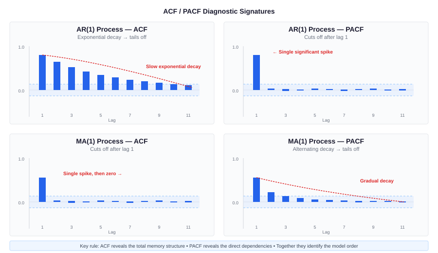
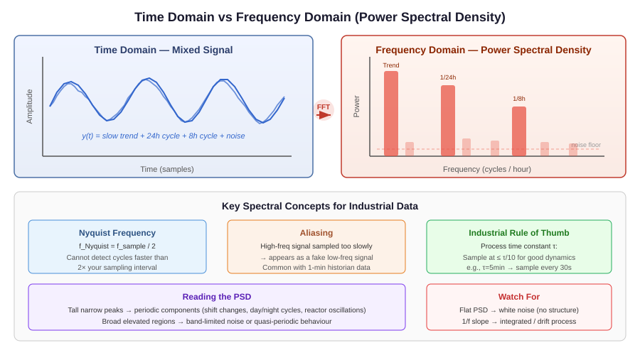
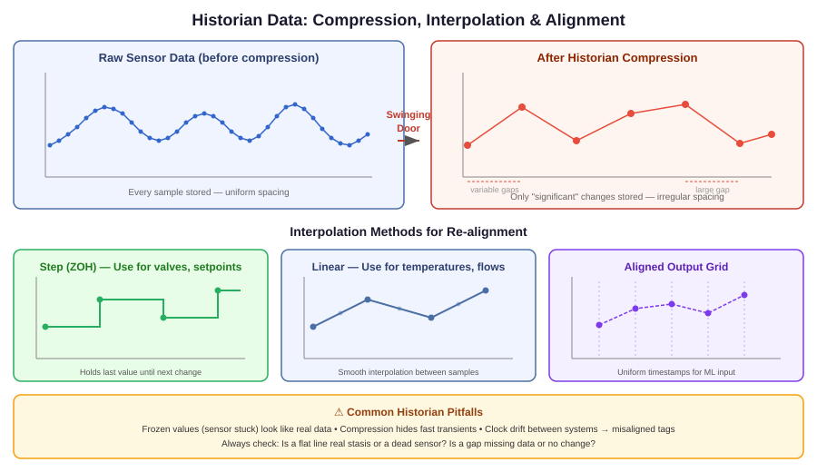
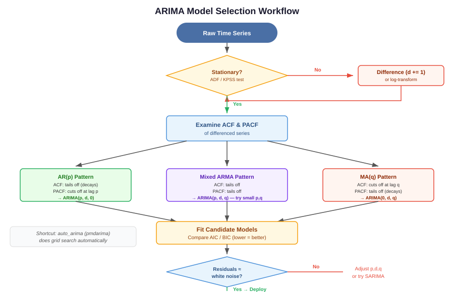
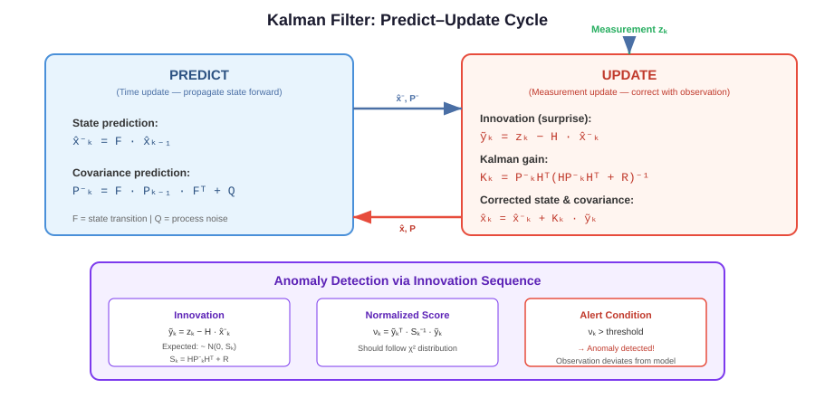
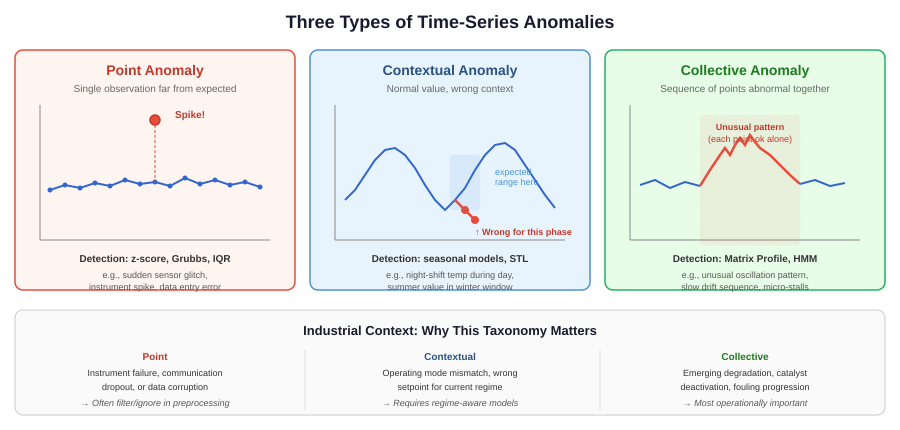
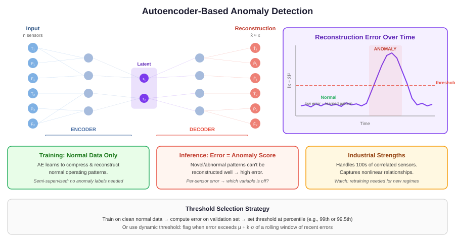
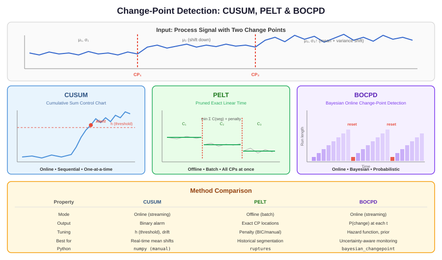
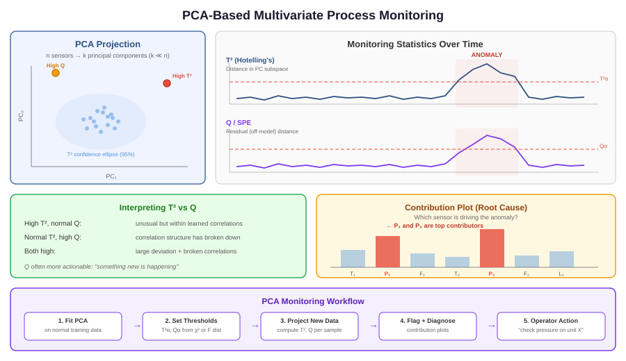

# Time-Series Analysis & Anomaly Detection for Industrial Processes

## Estimated Reading Time: 3–4 hours

This guide is structured for someone with deep learning and gradient boosting experience who needs to build working knowledge of time-series analysis and anomaly detection for industrial process data (refinery, ammonia, olefins plants). Each concept is compressed to its core intuition, practical implications, and failure modes.

---

# Phase 1: Time-Series Foundations

## 1.1 What Makes Time-Series Data Structurally Different

In tabular ML (XGBoost on process features, image classification), rows are assumed **independent and identically distributed (\(\text{i.i.d.}\))**. Shuffling rows doesn't change the problem. In time-series data, **the order is the information**. A reactor temperature of \(412\,^{\circ}\mathrm{C}\) means something completely different depending on whether it was \(405\,^{\circ}\mathrm{C}\) or \(420\,^{\circ}\mathrm{C}\) five minutes ago.

**Key intuition:** Every observation carries an invisible context — its recent past. Destroying that context (shuffling, naive train/test splits) destroys the signal you're trying to model.

**Practical implications:**
- You cannot do random train/test splits. You must use temporal splits (walk-forward validation), exactly as you would avoid data leakage in sequential recommendation systems.
- Feature engineering must respect causality: you can only use past values to predict/evaluate the present. A centered moving average uses future data — fine for decomposition, fatal for prediction.
- Adjacent observations are correlated. This means standard error estimates (confidence intervals, \(p\)-values) from \(\text{i.i.d.}\) assumptions are wrong — they'll be too narrow, making you overconfident.

**Common failure modes:**
- Using `sklearn.model_selection.KFold` instead of `TimeSeriesSplit` — this leaks future information into training.
- Computing rolling features using `center=True` in pandas during model training.
- Reporting model accuracy on randomly held-out points rather than a forward time period.

---

## 1.2 Stationarity

A time series is **stationary** if its statistical properties (mean, variance, autocorrelation structure) do not change over time. Not that the values are constant — that the *rules generating the values* are constant.

**Analogy from deep learning:** Stationarity is the time-series equivalent of the assumption that training and test data come from the same distribution. A non-stationary series is like having distribution shift baked into your dataset — the patterns you learn from January may not apply in June.

**Why it matters:** Almost every classical time-series model (ARIMA, exponential smoothing, spectral analysis) assumes stationarity or can only handle specific types of non-stationarity (like a linear trend). If you fit an AR model to a non-stationary series, the estimated coefficients are meaningless — this is called "spurious regression."

**Two standard tests:**

| Test | Null Hypothesis | Use When |
|------|----------------|----------|
| **ADF (Augmented Dickey-Fuller)** | Series has a unit root (non-stationary) | You suspect a trend or random walk. Reject → evidence of stationarity. |
| **KPSS** | Series is stationary | Confirmatory test. Reject → evidence of non-stationarity. |

Use both together. If ADF rejects and KPSS doesn't reject, you have strong evidence of stationarity. If they disagree, you likely have trend-stationarity (stationary after removing a deterministic trend) or need differencing.

**Industrial example:** A heat exchanger's outlet temperature may show a slow upward drift over months as fouling builds up. The raw signal is non-stationary (rising mean). But the *deviation from expected fouling trend* might be stationary — and that's where you'd look for anomalies.

**Making a series stationary:**
- **Differencing:** Replace $y_t$ with $y_t - y_{t-1}$. Removes trends. Apply twice for quadratic trends.
- **Log transform:** Stabilizes variance when it grows with the level (e.g., flow rates that become noisier at higher throughput).
- **Seasonal differencing:** $y_t - y_{t-s}$ where $s$ is the seasonal period.

**Common failure modes:**
- Over-differencing: applying $d=2$ when $d=1$ suffices. This introduces artificial negative autocorrelation and makes modeling harder.
- Ignoring regime-dependent stationarity: a column that's stationary during steady-state operation but non-stationary across startup/shutdown transitions. You need regime segmentation before stationarity testing.
- Treating ADF/KPSS as definitive. They have low power on short series and can't detect all forms of non-stationarity (e.g., changing variance).

---

## 1.3 Autocorrelation and Partial Autocorrelation

**Autocorrelation (ACF)** measures the correlation between a time series and lagged copies of itself. ACF at lag $k$ answers: "How correlated is today's value with the value $k$ steps ago?"

**Partial autocorrelation (PACF)** measures the *direct* correlation at lag $k$ after removing the influence of all shorter lags. It isolates the unique contribution of lag $k$.

**Analogy:** Think of ACF like total feature importance in a gradient-boosted model — feature 5 might look important because it's correlated with feature 3, which is the real driver. PACF is like SHAP values or permutation importance — it shows the *direct* effect after controlling for everything else.

*Diagram should show: Four panels — (1) ACF of an AR(1) process showing exponential decay, (2) PACF of the same AR(1) showing a single significant spike at lag 1, (3) ACF of an MA(1) process showing a single spike at lag 1 then cutting to zero, (4) PACF of the same MA(1) showing exponential decay. Each panel should have lag on x-axis, correlation on y-axis, and blue significance bands. Label the signature pattern for each.*

**Reading ACF/PACF — the diagnostic signatures:**

| Pattern | ACF | PACF | Interpretation |
|---------|-----|------|----------------|
| AR(p) process | Tails off (exponential/oscillating decay) | Cuts off after lag p | The process has direct memory of the last p values |
| MA(q) process | Cuts off after lag q | Tails off | The process is driven by the last q random shocks |
| ARMA(p,q) | Both tail off | Both tail off | Mixed — use information criteria to select orders |
| Non-stationary | ACF decays very slowly | Large spike at lag 1 | Needs differencing before modeling |

**Industrial example:** A pressure sensor in a distillation column typically shows strong AR behavior — current pressure depends directly on pressure a few time steps ago because of the physical inertia of the system. A flow controller responding to setpoint changes might show MA behavior — the controller applies corrections (shocks), and the effect persists for a few steps.

**Practical implication:** ACF/PACF are your first diagnostic tool when examining any process tag. Before fitting any model, plot these. They tell you what kind of model the data wants.

**Common failure modes:**
- Computing ACF on non-stationary data — you'll see slow decay that tells you nothing about the autocorrelation structure, only that you forgot to difference.
- Ignoring seasonal lags. In a plant with 24-hour operating cycles, check lag 1440 (at 1-minute sampling) or lag 48 (at 30-minute sampling). The ACF at seasonal lags reveals periodic patterns.
- Using too few lags. For historian data at 1-minute resolution, check at least a few hours of lags, and also check around known operational cycles.

---

## 1.4 Trend, Seasonality, and Residual Decomposition

Any time series can be decomposed into three components:

$$y_t = T_t + S_t + R_t \quad \text{(additive)}$$
$$y_t = T_t \times S_t \times R_t \quad \text{(multiplicative)}$$

- **Trend ($T_t$):** Long-term direction. In process data: catalyst deactivation causing slowly declining conversion, fouling causing gradually rising pressure drop.
- **Seasonality ($S_t$):** Repeating patterns at known periods. In process data: day/night ambient temperature cycling affecting cooling water temperature, weekly production schedule changes, seasonal feed quality variation.
- **Residual ($R_t$):** What's left after removing trend and seasonality. This is where anomalies live — and also where your model's signal is.

**Additive vs. multiplicative:** Use multiplicative when the seasonal swing grows proportionally with the level. If a heat exchanger shows \(\pm 2\,^{\circ}\mathrm{C}\) daily swings at \(200\,^{\circ}\mathrm{C}\) and \(\pm 4\,^{\circ}\mathrm{C}\) swings at \(400\,^{\circ}\mathrm{C}\), that's multiplicative. If the swing is always \(\pm 2\,^{\circ}\mathrm{C}\) regardless of level, that's additive.

**Two decomposition approaches:**

1. **Classical decomposition** (`statsmodels.tsa.seasonal.seasonal_decompose`): Uses moving averages. Simple, interpretable, but assumes fixed seasonal pattern. Fine for initial exploration.
2. **STL decomposition** (`statsmodels.tsa.seasonal.STL`): Uses LOESS (locally weighted regression) to allow the seasonal pattern and trend to evolve over time. Strongly preferred for real data.

**Key intuition:** Decomposition is not a model — it's a diagnostic. It helps you *see* what's happening. The residual component is particularly valuable: if your residuals still show structure (autocorrelation, patterns), your decomposition missed something.

**Industrial example:** A cooling tower outlet temperature decomposes cleanly: rising trend (fouling), daily seasonality (ambient temperature), and residuals. An anomaly in the residuals — a sudden jump not explained by trend or season — might indicate a fan failure or basin level problem.

**Common failure modes:**
- Using classical decomposition on data with changing seasonal amplitude — it will bleed seasonal variation into the residuals.
- Decomposing data that spans shutdowns without masking them first. A shutdown creates a massive artificial "trend change" that corrupts the entire decomposition.
- Choosing the wrong seasonal period. STL requires you to specify the period. Getting it wrong makes the decomposition meaningless. Use ACF or domain knowledge to identify the correct period.

---

## 1.5 The Spectral View: Frequency Content and Aliasing

Every time series can be represented as a sum of sine waves at different frequencies. The **power spectral density (PSD)** shows how much variance (energy) exists at each frequency.

**Analogy from deep learning:** If the time domain is like looking at pixel values directly, the frequency domain is like looking at the Fourier transform of an image. High-frequency components = fast oscillations (noise, vibration). Low-frequency components = slow drifts (fouling, catalyst deactivation). Just as CNNs implicitly learn frequency filters, understanding the spectral content tells you what temporal scales carry information.

*Diagram should show: Left panel — a time series composed of a slow drift plus a 24-hour cycle plus high-frequency noise. Right panel — the PSD (power vs frequency or period) showing three distinct peaks corresponding to each component. Arrow annotations connecting each peak to the corresponding pattern in the time domain. X-axis of PSD labeled in both frequency (Hz) and period (hours) for intuition.*

**Why this matters for industrial data:**

1. **Identifying dominant periods:** A PSD peak at 24 hours confirms ambient-driven cycling. A peak at 8 hours might reveal shift-change effects. Unexpected peaks at specific frequencies can indicate mechanical problems (e.g., a compressor at its rotation frequency).
2. **Separating signal from noise:** If your signal of interest is at low frequencies (slow fouling) and noise is at high frequencies (sensor jitter), a low-pass filter cleanly separates them. Without spectral understanding, you're guessing at filter parameters.
3. **Detecting oscillating control loops:** A valve hunting between open and closed creates a characteristic spectral signature — a peak at the oscillation frequency. This is one of the most valuable uses of spectral analysis in process control.

**Aliasing — the critical sampling constraint:**

The **Nyquist theorem** says you can only reliably detect frequencies below half your sampling rate \(f_s\): you can estimate frequencies in \([0,\, f_s / 2)\) (Nyquist frequency \(f_{\mathrm{Nyq}} = f_s / 2\)). At 1-minute sampling (\(f_s = 1/60\,\mathrm{Hz}\)), \(f_{\mathrm{Nyq}} = 1/120\,\mathrm{Hz}\) — oscillations faster than once per 2 minutes will "alias" (appear as false lower-frequency signals).

**Industrial consequence:** If a compressor vibrates at \(50\,\mathrm{Hz}\) but you sample at \(f_s = 1/60\,\mathrm{Hz}\), you will *not* see the vibration. Worse, you might see a ghost signal at a completely wrong frequency. Historian data at 30s–1min resolution is adequate for process dynamics (things that change over minutes to hours) but cannot capture mechanical vibration or fast electrical transients.

**Practical tools:**
- `scipy.signal.welch` — estimates PSD using Welch's method (averaged periodograms). More stable than a raw FFT.
- `scipy.signal.spectrogram` — shows how frequency content changes over time (a time-frequency representation). Essential when the dominant frequencies shift — e.g., a compressor speeding up.

**Common failure modes:**
- Applying FFT to non-stationary data without windowing or detrending — the trend creates a massive low-frequency spike that drowns out everything else.
- Ignoring aliasing when combining data from different sampling rates (e.g., 1-second DCS data merged with 1-minute historian data).
- Over-interpreting spectral peaks. A peak at a 24-hour period could be ambient temperature, shift changes, or daily lab adjustments. Spectral analysis tells you *what* frequencies exist, not *why*.

---

## 1.6 Process Dynamics vs. Measurement Noise

Every sensor reading in a plant is the sum of two things. With observation \(y_t\), latent process value \(x_t\), and measurement noise \(\varepsilon_t\):

$$y_t = x_t + \varepsilon_t$$

**Process dynamics** are the real physical changes — temperature rising because heat input increased, pressure dropping because a valve opened. **Measurement noise** is everything the sensor adds — electrical interference, quantization, calibration drift, thermocouple aging.

**Why this distinction matters for anomaly detection:** You need to detect anomalies in the *process*, not in the *sensor*. A noisy thermocouple that occasionally spikes by \(\pm 5\,^{\circ}\mathrm{C}\) is a measurement artifact, not a process anomaly. Conversely, a slow \(2\,^{\circ}\mathrm{C}\) drift over a week that's well within sensor noise could indicate real fouling.

**How to tell them apart:**

| Characteristic | Process dynamics | Measurement noise |
|---------------|-----------------|-------------------|
| Temporal structure | Autocorrelated (smooth, physics-driven) | Usually white (uncorrelated) or pink |
| Cross-correlation | Affects related tags (temp rise → pressure rise) | Affects only the noisy sensor |
| Spectral signature | Concentrated at low/mid frequencies | Flat or concentrated at high frequencies |
| Response to filtering | Signal preserved | Signal removed |

**Industrial example:** A reactor temperature tag shows \(0.5\,^{\circ}\mathrm{C}\) random jitter at 1-minute resolution (noise floor of the thermocouple) plus a true process change of \(3\,^{\circ}\mathrm{C}/\mathrm{h}\) due to catalyst deactivation. A simple moving average filter separates these because they live at different frequency scales.

**Practical implication:** Before running anomaly detection on any tag, understand its noise floor. A \(0.1\,^{\circ}\mathrm{C}\) change on a thermocouple with \(0.5\,^{\circ}\mathrm{C}\) noise is undetectable. The same \(0.1\,^{\circ}\mathrm{C}\) change on a high-precision RTD with \(0.01\,^{\circ}\mathrm{C}\) noise is a clear signal.

**Key tools:**
- **Allan variance / overlapping Allan deviation:** Characterizes noise as a function of averaging time. Standard in metrology, underused in process data.
- **Cross-correlation:** If a spike appears in one temperature tag but not in physically adjacent tags, it's likely measurement noise, not a real event.
- **Redundant sensors:** Many critical measurements have 2-of-3 or median-select configurations. Comparing redundant sensors directly isolates measurement noise.

---

## 1.7 Resampling, Alignment, and Handling Irregular Timestamps

Historian systems (PI, IP.21, Honeywell PHD) do not store data at perfectly regular intervals. They use **compression algorithms** (typically swinging-door compression) that only record a new value when the signal changes by more than a deadband threshold. This means:

- Data arrives at **irregular intervals** — a stable signal might have one point per hour; a changing signal might have points every second.
- **Missing data doesn't mean the sensor failed** — it means the value didn't change enough to trigger a new recording.
- Different tags have different compression settings, so timestamps across tags are **not aligned**.

*Diagram should show: Top — a true continuous signal with dots showing where the historian recorded points (clustered during changes, sparse during flat periods). Middle — the same signal reconstructed with step interpolation (last-known-value) showing the staircase effect. Bottom — two tags on different timelines being aligned to a common 1-minute grid, with arrows showing interpolation points. Highlight the difference between step interpolation (correct for most process data) and linear interpolation (appropriate for smoothly varying signals like temperature).*

**Alignment strategy for multi-tag analysis:**

1. **Choose a common time grid** — typically the coarsest resolution you need (e.g., 1-minute intervals).
2. **Decide interpolation method per tag:**
   - **Step (forward-fill):** Appropriate for discrete states (valve positions, on/off signals, setpoints). The value *is* the last known value until it explicitly changes.
   - **Linear interpolation:** Appropriate for continuously varying signals (temperature, pressure, flow) that change smoothly.
   - **No interpolation (NaN):** When gaps are too large to interpolate reliably. Define a maximum gap threshold per tag.
3. **Resample:** Use `pandas.DataFrame.resample()` with appropriate aggregation (mean, last, max — depending on the tag's semantics).

**Critical implementation details:**

- **Beware of interpolating across shutdowns.** If a sensor reads \(400\,^{\circ}\mathrm{C}\) before shutdown and \(25\,^{\circ}\mathrm{C}\) after, linear interpolation creates phantom readings at \(300\,^{\circ}\mathrm{C}\), \(200\,^{\circ}\mathrm{C}\), etc. Mask shutdown periods before interpolation.
- **Timestamps may not be in UTC.** Historian systems often store in local time. Daylight saving time transitions create duplicate or missing timestamps. Always convert to UTC for analysis, convert back for display.
- **Aggregation matters.** A 1-minute mean of a flow rate is physically meaningful (average flow). A 1-minute mean of a valve position (0 or 100%) can be meaningless — you might want "percent time open" instead.

**Common failure modes:**
- Forward-filling across multi-hour gaps and treating the result as real data. Define max-gap rules.
- Using linear interpolation for digital/discrete signals.
- Ignoring that compression settings differ between tags — one tag might have \(1\%\) deadband, another \(5\%\), making their effective resolutions very different.
- Merging historian exports without checking timezone consistency.

---

*End of Phase 1. Key takeaway: Before modeling anything, you need to understand the temporal structure (ACF/PACF), confirm or establish stationarity, separate signal from noise, and align your historian data onto a clean, consistent time grid. Every subsequent method assumes you've done this groundwork.*

# Phase 2: Classical and Statistical Time-Series Methods

## 2.1 Exponential Smoothing

Exponential smoothing produces forecasts by computing weighted averages of past observations, where the weights decay exponentially as observations get older. Recent values matter more than distant ones.

**The core idea:** Your best estimate of the next value is a blend of what you just observed and what you previously predicted:

$$\hat{y}_{t+1} = \alpha \cdot y_t + (1 - \alpha) \cdot \hat{y}_t$$

where $\alpha \in (0, 1)$ controls how fast old observations are forgotten. High $\alpha$ = reactive (tracks changes quickly, noisy). Low $\alpha$ = smooth (slow to respond, filters noise).

**Analogy:** This is an exponential moving average (EMA) — you've likely used it in training loss curves. The smoothing parameter $\alpha$ is analogous to momentum in SGD: high momentum (low $\alpha$) gives a smoother trajectory but responds slowly to sudden changes.

**Three variants, each adding a component:**

| Variant | Captures | Use When |
|---------|----------|----------|
| **Simple (SES)** | Level only | No trend, no seasonality. Stationary-ish process fluctuating around a slowly changing mean. |
| **Double (Holt)** | Level + trend | Signal has a drift direction. Catalyst deactivation showing declining conversion over weeks. |
| **Triple (Holt-Winters)** | Level + trend + seasonality | Signal has periodic patterns. Cooling water temperature with daily ambient cycling. |

**Industrial examples:**
- **SES:** Smoothing a noisy pH measurement for real-time display. The operator wants to see the underlying value, not the sensor jitter.
- **Holt:** Tracking the declining efficiency of a heat exchanger as fouling progresses — the trend component captures the degradation rate.
- **Holt-Winters (additive):** Modeling a column's reflux rate that has a daily cycle driven by ambient temperature, plus a gradual upward trend as feed composition shifts seasonally.

**Practical implications:**
- Exponential smoothing is often the *right* model for operational dashboards where you need a smooth "current state" estimate.
- The Holt-Winters forecast residuals are a useful baseline anomaly detector: if the residual exceeds a threshold, something changed that the smooth trend+season model didn't expect.
- `statsmodels.tsa.holtwinters.ExponentialSmoothing` fits these models and optimizes the smoothing parameters automatically.

**Common failure modes:**
- Applying SES to data with a clear trend — the forecast perpetually lags behind the true value.
- Using additive Holt-Winters when seasonal amplitude grows with the level (need multiplicative).
- Trusting the forecast far into the future. Exponential smoothing forecasts flatten out quickly — the trend component projects linearly forever, which is physically unrealistic. Use for short-term forecasting only (hours to days for process data).

---

## 2.2 ARIMA Family: Modeling Autocorrelation Structure

ARIMA (AutoRegressive Integrated Moving Average) is a family of models that explicitly captures the autocorrelation structure you identified with ACF/PACF in Phase 1.

**Building blocks:**

**AR(p) — AutoRegressive of order p:**
$$y_t = c + \phi_1 y_{t-1} + \phi_2 y_{t-2} + \cdots + \phi_p y_{t-p} + \varepsilon_t$$
The current value is a linear combination of the last $p$ values plus white noise. This models *inertia* — physical systems where the current state depends on recent states.

**Analogy:** AR is a linear recurrence relation. If you've worked with RNNs, AR(p) is like a linear RNN with a fixed lookback of $p$ steps and no hidden state nonlinearity.

**MA(q) — Moving Average of order q:**
$$y_t = c + \varepsilon_t + \theta_1 \varepsilon_{t-1} + \theta_2 \varepsilon_{t-2} + \cdots + \theta_q \varepsilon_{t-q}$$
The current value depends on the last $q$ random shocks (forecast errors). This models *short-lived disturbances* — a feed composition blip that affects the column for a few time steps then dissipates.

**Note:** "Moving Average" here is unrelated to the rolling-mean moving average. It's about the dependence on past *errors*, not past *values*.

**ARIMA(p, d, q):** Combines AR and MA after differencing $d$ times to achieve stationarity.
- $p$: number of autoregressive terms (lags of $y$)
- $d$: number of differences needed for stationarity
- $q$: number of moving average terms (lags of $\varepsilon$)

**SARIMA(p, d, q)(P, D, Q, s):** Adds seasonal AR, differencing, and MA at seasonal period $s$.

*Diagram should show: A flowchart starting with "Raw series" → "Plot & check stationarity (ADF/KPSS)" → branch: if non-stationary → "Difference (d times)" → re-test. If stationary → "Plot ACF/PACF" → decision tree: ACF cuts off at q → MA(q); PACF cuts off at p → AR(p); both tail off → ARMA, use AIC/BIC. Then: "Check residuals" → branch: if residuals are white noise → "Model adequate"; if residuals show structure → "Increase order or add seasonal terms." Side note: "auto_arima (pmdarima) automates this search."*

**Model identification workflow:**
1. Make the series stationary (determine $d$ and $D$).
2. Plot ACF/PACF of the differenced series.
3. Read the signatures (see Phase 1.3 table) to get candidate $p$ and $q$.
4. Fit candidate models and compare using **AIC** (Akaike Information Criterion) or **BIC** (Bayesian Information Criterion). Lower is better. BIC penalizes complexity more heavily.
5. Check residuals: they should be white noise (no remaining autocorrelation). Use `statsmodels` `plot_diagnostics()` or the Ljung-Box test.

**Practical shortcut:** `pmdarima.auto_arima()` automates the search over $(p, d, q)$ using information criteria. Use it as a starting point, but always inspect the residual diagnostics.

**Industrial example:** A distillation column's tray temperature, after removing the trend from slowly changing feed composition, might be well-described by AR(2) — the current temperature depends on the last two readings due to thermal inertia and the column's response dynamics. The residuals from this AR(2) model become your "innovation" series — unexpected deviations that might signal tray flooding, weeping, or a control malfunction.

**Common failure modes:**
- Selecting model order by minimizing training error instead of AIC/BIC — this overfits.
- Using `auto_arima` without inspecting residuals. It can converge on a local minimum in the search space.
- Fitting ARIMA to multi-regime data without segmentation. The model averages across regimes, fitting none of them well.
- Ignoring that ARIMA is a *linear* model. Nonlinear process dynamics (e.g., reactor runaway kinetics) require different approaches.

---

## 2.3 State-Space Models and the Kalman Filter

A state-space model separates the *hidden true state* of a system from the *noisy observations* you get from sensors. It consists of two equations:

**State equation (how the hidden state evolves):**
$$x_{t} = A \cdot x_{t-1} + B \cdot u_t + w_t$$

**Observation equation (how you measure the state):**
$$y_t = C \cdot x_t + v_t$$

where $x_t$ is the hidden state, $y_t$ is what the sensor reports, $u_t$ are known inputs (setpoint changes, valve positions), $w_t$ is process noise, and $v_t$ is measurement noise.

**Analogy from deep learning:** This is structurally identical to a latent variable model. The state equation is the "generative model" (how the latent state evolves), and the observation equation is the "decoder" (how latent states map to observations). The Kalman filter is the exact inference algorithm for this model when everything is linear and Gaussian — it's computing the posterior $p(x_t | y_{1:t})$.

**The Kalman filter does two things:**
1. **Predict:** Use the state equation to forecast where the hidden state should be.
2. **Update:** When a new observation arrives, blend the prediction with the observation. The **Kalman gain** determines the blend ratio — it's large when you trust the observation (low sensor noise) and small when you trust the prediction (low process noise).

*Diagram should show: A circular diagram with two phases. "Predict" phase: prior state estimate + state model → predicted state + predicted uncertainty (uncertainty grows). "Update" phase: predicted state + new measurement → corrected state + reduced uncertainty. Show the Kalman gain as the knob controlling how much the measurement pulls the estimate. Include a small sidebar showing: high sensor noise → small Kalman gain → trust prediction; low sensor noise → large Kalman gain → trust measurement.*

**Why this matters for industrial processes:**
- **Sensor fusion:** If you have three temperature sensors on the same pipe, the Kalman filter optimally combines them, weighting each by its reliability.
- **Missing data handling:** During the predict step, the filter propagates forward even without a new measurement. This naturally handles historian gaps.
- **Anomaly detection through innovation:** The difference between predicted and observed ($y_t - C \cdot \hat{x}_t$) is called the **innovation**. In a well-tuned Kalman filter, innovations should be white noise. Large innovations mean something unexpected happened — either a process anomaly or a sensor fault.
- **Tracking dynamics:** The Kalman filter explicitly models how fast a process changes vs. how noisy the sensors are. This is exactly the "process dynamics vs. measurement noise" distinction from Phase 1.6.

**Connection to ARIMA:** Every ARIMA model can be written in state-space form. The Kalman filter is the general framework; ARIMA is a special case. `statsmodels.tsa.statespace` exposes this — you can fit ARIMA models via the Kalman filter and get the innovation sequence for free.

**Industrial example:** A compressor discharge temperature measured by a thermocouple (noisy, \(2\,^{\circ}\mathrm{C}\) standard deviation) can be modeled with a state-space model where the hidden state is the true gas temperature. The Kalman filter provides a smooth estimate of the true temperature and flags when the innovation is unusually large — indicating either a process upset or a failing sensor.

**Common failure modes:**
- Mis-specifying the process noise vs. measurement noise ratio ($Q/R$). Too little process noise → the filter is sluggish and misses real changes. Too much process noise → the filter is jittery and just tracks the noisy sensor.
- Assuming linearity when the process is nonlinear (e.g., reaction kinetics, phase transitions). Use the Extended Kalman Filter (EKF) or Unscented Kalman Filter (UKF) for mild nonlinearity, or particle filters for severe nonlinearity.
- Using the Kalman filter without validating that innovations are actually white noise. Structured innovations mean your state model is wrong.

---

## 2.4 When Classical Methods Beat ML (and When They Don't)

This is a judgment call you'll make constantly. Here's the decision framework:

**Classical methods (exponential smoothing, ARIMA, Kalman filter) win when:**
- You have a **single tag** or a small number of related tags.
- The process is approximately **linear**.
- You need **interpretable parameters** (the AR coefficient tells you the process time constant; the seasonal period tells you the driving cycle).
- You have **short history** (weeks, not years) — classical models have far fewer parameters to estimate.
- You need a **credible uncertainty estimate** — classical models produce prediction intervals with known statistical properties.
- You're building a **baseline** — and you should always have one.

**ML methods (gradient boosting, LSTMs, Transformers) win when:**
- You have **many tags** with complex nonlinear interactions (multivariate problems).
- The relationship between inputs and output is **nonlinear** (reaction kinetics, multiphase flow).
- You have **abundant data** (years of history) to support the parameter count.
- You can engineer **rich features** (rolling statistics, cross-tag ratios, lagged values from related sensors).
- You care more about **predictive accuracy** than interpretability.

**The critical baseline discipline:** Never deploy an ML model without comparing it to a simple classical baseline. If your LSTM doesn't beat a Holt-Winters model on your specific problem, the LSTM is adding complexity without value. In process industries, this happens more often than ML practitioners expect — many process signals are well-described by low-order linear models.

**Industrial example:** Predicting the next 15 minutes of a reactor temperature given only its own history → ARIMA will likely suffice. Predicting the remaining useful life of a catalyst given 50 correlated sensor tags over 6 months → gradient boosting or a multivariate model is justified.

---

*End of Phase 2. Key takeaway: Classical methods are your baselines and your interpretability tools. Exponential smoothing for tracking and smoothing, ARIMA for modeling autocorrelation structure, Kalman filter for state estimation and innovation-based detection. Always fit one of these before reaching for more complex models. The residuals from these models are your first anomaly detection signal.*

# Phase 3: Anomaly Detection Foundations

## 3.1 Taxonomy of Anomalies

Not all anomalies are the same. The type of anomaly determines which detection method works.

**Point anomaly:** A single observation that is abnormal regardless of context. A reactor temperature of \(900\,^{\circ}\mathrm{C}\) when the normal range is \(350\)–\(420\,^{\circ}\mathrm{C}\). These are easy — a simple threshold catches them.

**Contextual anomaly:** An observation that is only abnormal given its context. A cooling water outlet temperature of \(40\,^{\circ}\mathrm{C}\) is normal on a July afternoon; it's anomalous on a January night. The *value* is ordinary; the *context* (time, season, operating mode, ambient conditions) makes it anomalous.

**Collective anomaly:** A sequence of observations that is anomalous as a group, even though each individual observation may look normal. A compressor vibration signal that slowly increases by \(0.1\,\mathrm{mm}/\mathrm{s}\) per day for 30 days — no single reading is flagged, but the upward trend is the anomaly. This is the hardest type to detect and the most industrially important.

*Diagram should show: A single time-series plot (e.g., reactor temperature over time). Mark three regions: (1) a point anomaly — a single sharp spike well outside the normal range, (2) a contextual anomaly — a value that's normal magnitude but occurs during a period (e.g., nighttime, marked by a shaded background) when it shouldn't, (3) a collective anomaly — a subtle upward drift over many points, none individually extreme, with a bracket indicating "anomalous as a pattern, not as individual points." Use distinct colors/annotations for each type.*

**Why this matters for method selection:**
- Point anomalies → statistical thresholds, z-scores, isolation forest work fine.
- Contextual anomalies → you need a model of "expected given context" (regression, conditional distribution). The anomaly is in the *residual*, not the raw value.
- Collective anomalies → you need methods that look at sequences: change-point detection, matrix profiles, sliding-window features.

**Industrial implication:** Most real-world process anomalies that matter are contextual or collective. Point anomalies (sensor spikes, range violations) are usually caught by existing DCS alarm systems. The value a data scientist adds is detecting the subtle contextual and collective anomalies that operators can't see by watching individual trend screens.

---

## 3.2 Supervised vs. Semi-Supervised vs. Unsupervised Anomaly Detection

**The label reality in industrial settings:**

In process plants, you almost never have clean anomaly labels. What you *do* have:

| What Exists | Quality as Labels |
|-------------|-------------------|
| Maintenance work orders | Partial: tell you what was fixed, not when the problem started |
| DCS alarm logs | Noisy: thousands of alarms, most are nuisance |
| Operator logbooks | Inconsistent: different operators record different things |
| Shutdown records | Good for macro events, no help for early detection |
| Root cause analysis reports | High quality but extremely rare (major incidents only) |
| Lab results flagged as off-spec | Useful for quality anomalies, delayed by hours/days |

**This means your realistic options are:**

**Unsupervised (most common starting point):** Learn "normal" from unlabeled data, flag deviations. Assumes the training data is mostly normal — which is true for most plant operations (anomalies are rare). Methods: isolation forest, autoencoders, PCA-based monitoring, LOF.

**Semi-supervised:** Train exclusively on known-good data (e.g., a stable operating period vetted by engineers), then flag anything that deviates from this baseline. This is the dominant paradigm in industrial anomaly detection. It's "one-class classification" — you model the normal class and call everything else anomalous.

**Supervised (rare luxury):** If you have enough labeled anomalies (typically from historical incident databases), you can train a classifier. In practice, this works for well-characterized failure modes (e.g., "compressor surge" has a known signature that's been observed 50+ times across a fleet of identical machines). It does not work for novel failure modes.

**Practical recommendation:** Start semi-supervised. Select a "golden period" of stable, normal operation (vetted by process engineers). Train your model on this period. Everything it doesn't recognize is an anomaly candidate. As you deploy and operators provide feedback (true positive / false positive labels on alerts), you gradually move toward supervised for known failure modes while maintaining unsupervised coverage for novel events.

---

## 3.3 Distance-Based Methods

**\(k\)-NN distance:** An observation is anomalous if its \(k\)-th nearest neighbor (in feature space) is far away. Normal points cluster together; anomalies are isolated.

**LOF (Local Outlier Factor):** Refines \(k\)-NN distance by comparing each point's local density to the density of its neighbors. A point in a sparse region surrounded by dense regions is anomalous. This handles datasets with clusters at different densities — a point that's normal in a dense cluster would be anomalous in a sparse one.

**Analogy:** Think of LOF like a local normalization. In computer vision, an object at one scale might be normal in one image region but anomalous in another with different context. LOF does this in feature space — it asks "is this point unusual *relative to its neighborhood*?" not just "is this point far from the global mean?"

**Assumptions and limitations:**
- Requires a meaningful distance metric. For high-dimensional sensor data, Euclidean distance becomes unreliable (the "curse of dimensionality" — all points become roughly equidistant). You'll need dimensionality reduction (PCA, autoencoders) or careful feature selection.
- Computationally expensive for large datasets: \(k\)-NN search is \(O(n^2)\) naively, \(O(n \log n)\) with tree structures.
- These are static methods — they don't account for temporal ordering. Point \(A\) followed by point \(B\) might be normal, while \(B\) followed by \(A\) is anomalous. \(k\)-NN/LOF can't see this.

**Industrial example:** Represent each 15-minute window of a compressor's operation as a vector of [suction pressure, discharge pressure, suction temperature, discharge temperature, power, vibration]. LOF on these vectors can identify windows where the operating point is unusual relative to similar conditions — e.g., abnormally high power consumption for a given pressure ratio, suggesting reduced efficiency.

---

## 3.4 Statistical Methods

**Z-score:** For residual or value \(y_t\) with mean \(\mu\) and standard deviation \(\sigma\),

$$z_t = \frac{y_t - \mu}{\sigma}.$$

Flags points more than \(k\) standard deviations from the mean (threshold on \(|z_t|\)).

**Grubbs' test:** Tests whether the most extreme value in a sample is an outlier, assuming the data is normally distributed.

**ESD (Extreme Studentized Deviate):** Generalization of Grubbs' for detecting multiple outliers.

**The critical assumption:** All of these assume the data is **stationary** (or at least that mean and variance are constant over the window you're computing them on). Applying a z-score to a trending signal will flag the early or late values as anomalous simply because they're far from the overall mean — they're not anomalies, they're trends.

**How to use them correctly on process data:**
1. Remove trend and seasonality first (Phase 1.4).
2. Apply statistical tests to the **residuals**, not the raw signal.
3. Use a **rolling window** z-score if the residual distribution changes slowly over time:

$$z_t = \frac{r_t - \mu_{[t-w,\,t-1]}}{\sigma_{[t-w,\,t-1]}}.$$

**Window size tradeoff:** Too small → noisy estimates of $\mu$ and $\sigma$, high false positive rate. Too large → slow to adapt, may include data from different operating regimes. Typical starting points for 1-minute process data: 1–4 hours for fast process dynamics, 1–7 days for slow degradation.

**Industrial example:** A rolling z-score on the residuals of a reactor temperature model (after removing the trend from catalyst aging and the daily ambient cycle). A z-score exceeding 3 suggests a process disturbance not explained by the model — a feed composition upset, a cooling water anomaly, or an instrument fault.

**Common failure modes:**
- Applying z-scores to raw (non-detrended) data.
- Using a global mean/std from training data without checking if the distribution has shifted.
- Assuming normality when the data is skewed (e.g., concentration measurements near zero). Use robust alternatives: median absolute deviation (MAD) instead of standard deviation.

---

## 3.5 Density-Based and Ensemble Methods

**Isolation Forest:** The key insight is that anomalies are easier to isolate than normal points. The algorithm builds random trees by randomly selecting a feature and a random split point. Anomalous points (being few and different) get isolated in fewer splits — they have shorter average path lengths in the trees.

**Analogy from gradient boosting:** You understand random forests — isolation forest uses the same tree structure but inverts the objective. Instead of predicting a target, it measures how quickly each point gets isolated. It's an ensemble of random trees where short path length = anomalous.

**Strengths:** Scales linearly with data size (\(O(n \log n)\)), handles high-dimensional data well, no distance metric needed, no distribution assumptions. One of the best general-purpose anomaly detectors.

**One-Class SVM:** Learns a boundary around the normal data in kernel space. Everything outside the boundary is anomalous. Works well with RBF kernels when the normal data occupies a compact region. Less scalable than isolation forest for large industrial datasets.

**Autoencoders for anomaly detection:** Train an autoencoder to reconstruct normal data. Anomalies produce high reconstruction error because the autoencoder has never learned to reconstruct abnormal patterns.

**Analogy you know well:** You've used autoencoders in deep learning. The anomaly detection version is identical in architecture — the insight is that reconstruction error *is* the anomaly score. A denoising autoencoder trained on normal compressor data will faithfully reconstruct normal vibration patterns but produce high error on patterns associated with bearing degradation, because those patterns weren't in the training data.

*Diagram should show: Left — input time window of sensor data flowing into an encoder (compression bottleneck) and decoder producing a reconstruction. Middle — for normal data, input and reconstruction are similar (low error). Right — for anomalous data, reconstruction fails to capture the abnormal pattern (high error). Below — a time series of reconstruction error with a threshold line, with anomalous periods highlighted where error exceeds the threshold.*

**Choosing the bottleneck dimension:** Too large → the autoencoder memorizes and reconstructs everything, including anomalies (no detection power). Too small → it can't even reconstruct normal data, generating false alarms everywhere. Tune on a validation set of known-normal data — the bottleneck should be large enough that normal reconstruction error is low but small enough that it can't represent rare anomalous patterns.

**Common failure modes:**
- Training the autoencoder on data that includes anomalies. Since anomalies are rare, the autoencoder won't focus on them, but if a particular failure mode recurs frequently (e.g., monthly compressor surge events), it might learn to reconstruct it, defeating detection.
- Using reconstruction error alone without considering the *pattern* of error. Two points with the same total reconstruction error might have very different error distributions across sensors — one might be sensor noise (uniform small errors) and the other a real process event (large error concentrated on a few related sensors).
- Overfit autoencoder on normal data: reconstructs normal data perfectly but also anomalous data if the anomaly is a mild variation of normal patterns.

---

## 3.6 Evaluation When Labels Are Scarce

**Why accuracy is meaningless:** If anomalies are \(0.1\%\) of your data (typical in stable plant operations), a model that predicts “normal” for everything achieves \(99.9\%\) accuracy. Useless.

**Why F1 can mislead:** \(F_1\) is the harmonic mean of precision and recall. With extreme class imbalance, a model with \(50\%\) precision and \(50\%\) recall gets \(F_1 = 0.50\) — which sounds decent. But in production, \(50\%\) precision means half your alerts are false alarms. Operators will ignore the system within a week.

**The metrics that matter in industrial anomaly detection:**

**Precision (at the alert level):** Of the alerts generated, what fraction pointed to real problems? This directly maps to operator trust. Target: \(> 80\%\) in production.

**Recall (at the event level):** Of the real events that occurred, what fraction did the system catch? Note the critical distinction: compute recall per *event* (did we detect the problem at all, even if we missed some individual anomalous points?), not per *point*.

**Time-to-detection:** How early before the event became obvious did the system alert? This is the real value proposition — catching problems hours or days before they'd be noticed otherwise.

**False alarm rate:** Alerts per unit time during known-normal operation. This is what determines whether operators trust or ignore the system.

**The precision-recall tradeoff in practice:**

$$\text{More sensitive threshold} \implies \text{Higher recall, lower precision, more false alarms}$$
$$\text{Less sensitive threshold} \implies \text{Lower recall, higher precision, fewer false alarms}$$

For most industrial applications, err toward precision. Missing a few events is tolerable if operators trust the system. A system that cries wolf loses all value regardless of its recall.

**Evaluation strategies without labels:**
- **Expert review:** Show ranked anomaly scores to process engineers. They can often quickly confirm or reject the top anomalies. This gives you a partial labeled set.
- **Known event alignment:** Align detected anomalies with known events (shutdowns, maintenance, incidents). If your anomalies cluster before known problems, the system is working.
- **Stability analysis:** Run the model on known-stable periods. Any alerts during these periods are definitionally false positives.

**Common failure modes:**
- Reporting area under ROC curve (AUC-ROC). With extreme imbalance, AUC-ROC is misleadingly optimistic — use AUC-PR (precision-recall) instead.
- Computing point-level \(F_1\) on anomaly segments. If the system detects a 4-hour event but the labeled event is 5 hours, naive point-level evaluation penalizes the 1-hour mismatch heavily. Use event-level evaluation or a tolerance window.
- Optimizing threshold on test data. Set thresholds on a validation set (known-normal period + a few known events), then evaluate on a held-out period.

---

*End of Phase 3. Key takeaway: Most industrial anomalies are contextual or collective, not point anomalies. You'll likely work in a semi-supervised setting (model normal, flag deviations). Autoencoder reconstruction error and isolation forest are strong general-purpose methods. Evaluate on precision at the alert level and recall at the event level, not accuracy or \(F_1\). Operator trust is your ultimate metric.*

# Phase 4: Time-Series Anomaly Detection

## 4.1 Residual-Based Detection

This is the bridge between Phase 2 and Phase 3. The idea is simple and powerful:

1. **Fit a time-series model** to the signal (ARIMA, exponential smoothing, Kalman filter, or even a regression against known inputs like ambient temperature or feed rate).
2. **Compute residuals:** $r_t = y_t - \hat{y}_t$
3. **Apply anomaly detection to the residuals** (z-score, rolling threshold, isolation forest — any method from Phase 3).

**Why this works:** The model captures the *expected* behavior — the trend, seasonality, autocorrelation, and response to known inputs. The residual is what's *unexplained*. Anomalies live in the unexplained.

**Analogy:** This is exactly like the "reconstruction error" approach for autoencoders, but using interpretable statistical models instead of neural networks. The model "reconstructs" the expected value; the residual is the reconstruction error.

**The quality of your anomaly detection is capped by the quality of your model.** A poor model produces large residuals during normal operation (high noise floor), drowning out real anomalies. A good model produces small, white-noise residuals during normal operation, so even a slight process disturbance stands out.

**Residual diagnostics checklist:**
- Are residuals approximately zero-mean? (If not, the model has a bias.)
- Are residuals constant-variance? (If variance changes, use a rolling threshold, not a global one.)
- Are residuals uncorrelated? (Check ACF. If there's remaining autocorrelation, the model is missing structure — go back and improve it.)
- Are residuals approximately normal? (Affects threshold calibration. Use MAD for robust thresholds if non-normal.)

**Industrial example:** Model a heat exchanger outlet temperature as a function of inlet temperature, flow rate, and ambient temperature (regression). The residuals represent deviations not explained by these inputs. A gradual upward drift in residuals → fouling (the exchanger is less efficient than the model expects). A sudden spike → process upset or sensor fault.

**Common failure modes:**
- Using a model that's too flexible (high-order ARIMA, overfit neural network) — it absorbs the anomalies into its predictions, producing small residuals even during anomalous periods. The model "explains away" the anomaly.
- Not retraining the model as the process drifts. A model trained on data from a fresh catalyst will produce false alarms as the catalyst ages, because the aging is normal but wasn't in the training data.
- Ignoring the model's prediction uncertainty. A residual of \(5\,^{\circ}\mathrm{C}\) means different things at a point where the model's \(95\%\) prediction interval is \(\pm 2\,^{\circ}\mathrm{C}\) vs.\ \(\pm 10\,^{\circ}\mathrm{C}\). Use *standardized* residuals: \(r_t / \hat{\sigma}_t\).

---

## 4.2 Change-Point Detection

Change-point detection identifies moments when the statistical properties of a time series abruptly shift. This is distinct from anomaly detection: an anomaly is a *deviant observation*, while a change-point marks a *regime transition*.

**Why this matters industrially:** Many real-world "anomalies" are actually regime changes — a catalyst suddenly loses activity, a heat exchanger transitions from clean to fouled, a compressor enters surge. The values after the change may each look individually normal (the system found a new steady state), but the *fact that a shift occurred* is the signal.

**Three key methods:**

**CUSUM (Cumulative Sum):**
Track the cumulative sum of deviations from a target mean. When the process is on target, the cumulative sum random-walks around zero. When the mean shifts, the cumulative sum develops a persistent trend.

$$S_t = \max\left\{0,\, S_{t-1} + (y_t - \mu_0 - k)\right\}$$

where $\mu_0$ is the target mean and $k$ is a slack parameter (minimum shift size you want to detect). An alarm triggers when $S_t$ exceeds threshold $h$.

**Intuition:** CUSUM integrates small, consistent deviations. A single outlier bumps $S_t$ up but it decays back. A sustained shift causes $S_t$ to grow steadily. It's a detector for collective anomalies — persistent shifts too small for any single point to trigger a threshold.

**PELT (Pruned Exact Linear Time):**
An offline algorithm that finds the optimal set of change-points that minimizes a penalized cost function. "Offline" means it processes the entire series at once — use it for historical analysis, not real-time detection.

**Bayesian Online Change-Point Detection (BOCPD):**
Maintains a probability distribution over "how long since the last change-point" (the run length). At each time step, it updates this distribution. When the probability of run length = 0 spikes, a change-point is likely.

**Analogy:** BOCPD is like a Bayesian version of attention in transformers. It dynamically decides how far back in time to look — when a change-point occurs, it "resets" and starts building a new context window.

*Diagram should show: A single time series with two true change-points (mean shifts at t=200 and t=500). Below it, three panels: (1) CUSUM statistic rising and triggering at each change-point, (2) PELT output showing detected segments as colored blocks, (3) BOCPD run-length posterior as a heatmap (time on x-axis, run length on y-axis, probability as color intensity) showing the run length resetting to zero at change-points.*

**Choosing a method:**
- **CUSUM:** Real-time, simple, well-understood. Good for monitoring a specific parameter against a target. Standard in statistical process control (SPC).
- **PELT:** Offline historical analysis. "Where did things change in this 2-year dataset?" Fast and exact.
- **BOCPD:** Online with principled uncertainty. Best for situations where you need to adapt to change-points in real time and want a probability of change rather than a binary alarm.

**Industrial example:** Monitoring catalyst activity (measured as conversion rate normalized for operating conditions). CUSUM on the conversion residuals detects the point where deactivation rate accelerated — this might be weeks before the product quality drops below spec, giving operations time to plan a catalyst change.

**Common failure modes:**
- CUSUM slack parameter $k$ too large → misses small shifts. Too small → triggers on noise.
- PELT penalty too low → over-segments (finds change-points in noise). Too high → misses real changes. Use information criteria (BIC-based penalty) as a starting point.
- Not distinguishing level shifts from trend changes. A step change in mean and a gradual ramp-up look different but both trigger change-point detectors. Check the change type post-detection.

---

## 4.3 Matrix Profiles

The matrix profile is a data structure that, for every subsequence of length $m$ in a time series, stores the **distance to its nearest neighbor** (the most similar subsequence elsewhere in the series).

**The "Shazam for time-series" intuition:** Shazam works by finding the closest match in a database of known fingerprints. The matrix profile does the same — for every window, it finds the best match. Subsequences with *no* good match (high matrix profile value) are **discords** — they're unique, never-before-seen patterns. These are your anomalies.

Conversely, subsequences with very good matches (low matrix profile value) that recur throughout the data are **motifs** — repeated patterns. In a plant, motifs might be normal startup sequences, batch cycle phases, or daily operational patterns.

**How it works (high level):**
1. Slide a window of length $m$ across the time series.
2. For each window position $i$, compute the z-normalized Euclidean distance to every other window position $j$.
3. Store the minimum distance (nearest neighbor distance) as \(\mathrm{MP}[i]\).
4. The index of the nearest neighbor is stored in the **matrix profile index**.

**Efficiency:** The naive approach is \(O(n^2 m)\), but the STOMP/STUMPY algorithms compute it in \(O(n^2)\) by exploiting the structure of sliding-window distance computations. The `stumpy` library implements this efficiently and can handle millions of data points.

**Why this is powerful for industrial data:**
- **Assumption-free:** No model to fit, no distribution to assume. Just pattern matching.
- **Discovers unknown anomalies:** You don't need to specify what you're looking for. The highest matrix profile values are the most unusual patterns in the data.
- **Motif discovery is equally valuable:** Finding repeated patterns (motifs) helps you understand normal behavior, identify operational modes, and detect when a "normal" pattern stops appearing.

**Industrial example:** Compute the matrix profile of a compressor's vibration signal (or a derived feature like vibration RMS in 1-minute windows) with $m = 60$ (1-hour subsequences). Discords — 1-hour windows that don't match anything else in the history — might correspond to: early bearing degradation, unusual surge events, or operating conditions the compressor has never experienced.

**The window size $m$ tradeoff:**
- Too small → catches only local spikes (like point anomaly detection; you don't need a matrix profile for this).
- Too large → averages out short anomalies; also computationally more expensive and requires anomalous patterns to be sustained.
- Start with \(m\) corresponding to \(1\)–\(4\) times the characteristic process time scale (e.g., if a reactor takes 30 minutes to respond to a disturbance, try \(m\) = 30–120 minutes of data).

**Common failure modes:**
- Not z-normalizing subsequences. Without normalization, distance is dominated by level differences, not shape differences. A normal pattern at a different operating level looks like a discord.
- Interpreting matrix profile values without context. A high value might be a true anomaly or might just be a rare-but-normal operating condition (e.g., a planned rate change that only happens twice a year). Combine with domain knowledge.
- Using matrix profiles on multivariate data naively. The standard matrix profile is univariate. For multivariate data, compute profiles per tag and combine, or use the multidimensional matrix profile (mSTAMP in `stumpy`).

---

## 4.4 Multivariate Anomaly Detection: PCA-Based Monitoring

In a real plant, no sensor operates in isolation. A reactor temperature, coolant flow, catalyst bed pressure drop, and product composition are all coupled by thermodynamics and fluid mechanics. Anomaly detection must consider tags *together*.

**PCA (Principal Component Analysis) for process monitoring** — the industrial standard, often called **MSPC (Multivariate Statistical Process Control)**:

1. Collect a matrix of \(n\) time points \(\times\) \(p\) sensor tags during normal operation.
2. Standardize each tag (zero mean, unit variance).
3. Compute PCA. The first $k$ principal components capture the correlated "normal" behavior — the process sitting within its normal operating envelope.
4. Monitor two statistics:
   - **Hotelling's $T^2$:** Measures distance from the mean *within* the PCA model space (the first $k$ components). High $T^2$ = the process is at an unusual but still "explainable" operating point. Think of it as an unusual combination of the main process modes.
   - **$Q$ statistic (SPE — Squared Prediction Error):** Measures distance *outside* the PCA model space (the residual from the discarded components). High $Q$ = the correlation structure between tags has broken down. Something is happening that the normal model can't represent.

*Diagram should show: Left — a 3D scatter plot of normal operating data (a cloud/ellipsoid) with PC1 and PC2 defining the model plane and the third direction being the residual space. Show a normal point projected onto the plane (its T² is the distance from center within the plane, its Q is the distance from the plane). Show an anomalous point with high Q (far from the plane). Right — time series of T² and Q statistics with control limits (dashed lines), showing an anomalous event where Q spikes above its limit while T² may or may not spike.*

**Analogy:** PCA-based monitoring is dimensional reduction for anomaly detection. You've used PCA or autoencoders to reduce dimensions. Here, the reconstruction error *is* the $Q$ statistic, and the distance in latent space *is* $T^2$. If you replace PCA with an autoencoder, you get a nonlinear version of the same framework.

**$T^2$ vs. $Q$ — what they tell you:**

| | $T^2$ high, $Q$ normal | $T^2$ normal, $Q$ high | Both high |
|-|------------------------|------------------------|-----------|
| Meaning | Unusual operating point but correlations intact | Operating point is normal but correlations broke | Both — unusual point with broken correlations |
| Example | Running at much higher throughput than usual (everything scaled proportionally) | Heat exchanger fouled — temperature is high relative to flow and cooling, breaking the normal T-F correlation | Compressor surge — everything is off simultaneously |

**Why this is the industrial standard:** Chemical engineers have used $T^2$ and $Q$ charts since the 1990s. They're interpretable (contribution plots show *which* sensors drive the anomaly score), statistically grounded, fast to compute, and work well with the hundreds of correlated tags found in a typical process unit.

**Contribution plots:** When $T^2$ or $Q$ exceeds its limit, compute each variable's contribution to the statistic. This tells operators *which* sensors are behaving abnormally — essential for diagnosis. Without contribution plots, the operator gets "something is wrong" but not "what's wrong."

**Multivariate autoencoders** extend this to nonlinear relationships. Train an autoencoder on the \(n \times p\) matrix of normal operating data. The reconstruction error per tag plays the same role as PCA contributions. The total reconstruction error is the analog of $Q$.

**Common failure modes:**
- Choosing $k$ (number of retained PCs) poorly. Too few → high noise in $T^2$, real process variation thrown into $Q$. Too many → anomalies absorbed into the model. Use scree plot + process knowledge.
- Training on data that includes multiple operating regimes (startup, shutdown, different product grades). PCA blurs them together, and the "normal" envelope becomes so wide it catches nothing. Segment by regime first.
- Computing PCA on raw (non-standardized) data. The tag with the largest variance (often flow rates, which might be 0–1000, vs. temperatures at 300–350) dominates all components.
- Ignoring temporal dynamics. Standard PCA treats each time point independently. If you need to capture dynamic behavior (the relationship between tag A now and tag B 5 minutes ago), use Dynamic PCA (include time-lagged columns) or dynamic latent variable models.

---

## 4.5 Sliding-Window Feature Extraction

Many anomaly detection methods work on feature vectors, not raw time points. The bridge from raw time-series to feature vectors is the **sliding window**.

**The approach:**
1. Define a window of length $w$.
2. Slide it across the time series (or multivariate time series) at some step size $s$.
3. For each window, compute summary features.
4. Apply any anomaly detection method from Phase 3 to the resulting feature matrix.

**Common features per window:**

| Feature | What It Captures |
|---------|-----------------|
| Mean, median | Level |
| Standard deviation, IQR | Variability / noise level |
| Skewness, kurtosis | Distribution shape changes |
| Min, max, range | Extremes |
| Number of zero-crossings (of detrended signal) | Oscillation frequency |
| Slope (linear fit) | Local trend |
| Autocorrelation at lag 1 | Smoothness / persistence |
| Spectral entropy | Complexity of frequency content |
| RMS (root mean square) | Energy |

**The window-size tradeoff (again):**
- Smaller windows → higher temporal resolution, but noisier features, more sensitive to point anomalies.
- Larger windows → smoother features, captures collective anomalies, but lower temporal resolution, may smear boundaries of anomalous periods.

**Rule of thumb:** The window should be at least \(2\)–\(3\) times the characteristic time scale of the anomaly you want to detect. For a heat exchanger that takes 30 minutes to noticeably foul, a 1-hour window captures the trend. For a compressor surge event lasting 10 seconds, you need sub-minute windows (which may require higher-resolution data than your historian provides).

**Step size \(s\):** Using \(s = w\) (non-overlapping windows) is faster but can split an anomaly across window boundaries. Using \(s = 1\) (maximally overlapping) gives the best resolution but is roughly \(w\) times as expensive. A common compromise is \(s = w/4\) (\(75\%\) overlap).

**Industrial example:** For a multivariate compressor health monitor with 8 sensor tags, use $w$ = 60 minutes, $s$ = 15 minutes. For each window, compute [mean, std, slope, autocorrelation_lag1] for each tag → 32 features. Feed into an isolation forest. Windows with high anomaly scores flag periods of unusual compressor behavior.

---

## 4.6 "Something Unusual" vs. "Something Bad"

This is the most important conceptual distinction in applied anomaly detection.

**Anomaly detection finds statistical deviations from normal.** It does not distinguish between:
- A process upset that will cause equipment damage (bad)
- A planned rate change by the operator (unusual but fine)
- A sensor recalibration (the sensor changed, not the process)
- A rare but normal operating condition (e.g., processing a different feedstock once a quarter)

**The gap between "unusual" and "bad" can only be closed with domain knowledge.** Statistical methods will always flag rate changes, feed switches, and calibration events as anomalies — because they *are* statistically unusual. The question is whether they're *operationally concerning*.

**Strategies for closing the gap:**
1. **Context enrichment:** Annotate anomalies with operating mode, recent setpoint changes, maintenance activity, and lab results. An anomaly during a planned rate change is explained; the same anomaly during steady-state operation is concerning.
2. **Physical plausibility checks:** A temperature anomaly that correlates with flow and pressure changes (consistent with thermodynamics) suggests a real process shift. A temperature anomaly with no correlated changes elsewhere suggests a sensor fault.
3. **Root cause contribution:** Use contribution plots (PCA) or SHAP values (ML models) to identify *which* variables drive the anomaly score. Operators can quickly assess whether the combination makes physical sense.
4. **Operator feedback loop:** Present anomalies to operators, collect labels (real / false alarm / explained), use these labels to refine the model and suppress known benign patterns.

---

## 4.7 Handling Regime Changes

A process plant does not operate in a single steady state. It cycles through:
- **Startup / shutdown** (wildly non-stationary, every tag changing rapidly)
- **Grade changes / product transitions** (setpoints changing, process seeking new steady state)
- **Steady-state at different rates** (\(70\%\) vs.\ \(100\%\) capacity — different baselines)
- **Degraded operation** (running with a fouled exchanger, bypassed equipment, or derated compressor)

**Anomaly detection must be regime-aware.** A temperature of \(350\,^{\circ}\mathrm{C}\) is normal at \(100\%\) rate and anomalous at \(70\%\) rate. A pressure fluctuation of \(\pm 5\,\mathrm{psi}\) is normal during startup and anomalous during steady state.

**Two approaches:**

**1. Explicit regime segmentation (preferred):**
- Define operating regimes using process knowledge: production rate thresholds, unit status flags, time-based rules for startup/shutdown.
- Train separate anomaly detection models per regime, or exclude non-steady-state data from training and only monitor during steady state.
- Gate your alerts: suppress anomaly alerts during known transient periods.

**2. Regime as a feature:**
- Include operating mode indicators (production rate, active/inactive flags, time-since-startup) as features in your model. The model learns that certain patterns are normal given the regime context.
- This works if you have enough data from each regime. Rare regimes (annual turnaround startup) may not have enough data for the model to learn.

**The practical default:** Start with explicit segmentation. Label each time period as "steady state at rate X," "startup," "shutdown," "transition," or "abnormal." Only run anomaly detection during steady-state periods. This eliminates the largest source of false positives in industrial anomaly detection. Expand to transient monitoring later once the steady-state system is proven.

**Common failure modes:**
- Not segmenting at all. This is the #1 source of false alarms in industrial anomaly detection. Every startup triggers hundreds of alerts.
- Using a single "normal" model that was trained on mixed-regime data. The model learns a wide "normal" envelope that includes startup transients, so it fails to flag anomalies during steady state.
- Hardcoding regime boundaries. Startups don't always follow the same timeline. Use process-based criteria (e.g., “steady state = production rate within \(\pm 5\%\) of target for \(> 30\) minutes and all critical temperatures within \(\pm 10\,^{\circ}\mathrm{C}\) of setpoint”) rather than “\(t = \text{startup\_time} + 4\,\mathrm{h}\)”.

---

*End of Phase 4. Key takeaway: Time-series anomaly detection is about fitting a model of "expected" behavior and flagging what's left. Residual-based methods connect your time-series models to anomaly scores. Change-point detection catches regime shifts. Matrix profiles find unusual patterns without any model at all. PCA-based monitoring is the industrial standard for multivariate systems. But none of these methods know "unusual" from "bad" — that requires domain knowledge, context, and operator feedback.*

# Phase 5: Industrial Application and Deployment

## 5.1 Historian Data Quality

Before any analysis, you must understand how bad your data can be. Historian systems are recording infrastructure, not analytical infrastructure, and they introduce systematic artifacts.

**Sensor freezes:** A sensor value that stops updating but the historian continues reporting the last known value. On a trend screen, this looks like a perfectly flat line. In your data, it looks like repeated identical values — which is physically implausible for an analog measurement (even a stable temperature fluctuates by the sensor's noise floor). **Detection:** flag runs of identical values longer than $n$ samples (where $n$ depends on the sensor type and compression settings).

**Range clamps:** Sensors have configured ranges (e.g., \(0\)–\(500\,^{\circ}\mathrm{C}\) for a thermocouple transmitter). When the true value exceeds the range, the historian records the min or max. This creates flat lines at exactly the configured limits. **Detection:** flag values exactly at known transmitter limits.

**Bad-quality flags:** Most historians store a quality code alongside each value. Values with bad quality (sensor fault, communication error, manual override) should be masked before analysis. **Critical:** these flags are often stored but not exported by default. Ensure your data extraction includes quality codes.

**Communication dropouts:** Entire groups of tags go missing simultaneously when a controller or network link fails. This creates coordinated gaps across many tags — which can look like a collective anomaly to a multivariate model. **Detection:** if many tags go missing at the same time, it's infrastructure, not process.

**Compression artifacts:** Swinging-door compression (Phase 1.7) distorts the data. Fast transients are under-sampled, and the reconstructed signal has a characteristic "sawtooth" shape between recorded points. For high-frequency analysis, you may need to request uncompressed data from the historian (if available) or use higher-resolution DCS data.

**Practical checklist before any modeling:**
1. Check for frozen sensors (runs of identical values).
2. Check for range-clamped values (at known transmitter limits).
3. Filter on quality flags.
4. Identify and mask communication dropouts (many tags missing simultaneously).
5. Understand each tag's compression settings (deadband, deviation).
6. Verify physical units (historian tag configurations can be wrong).

---

## 5.2 Shutdown/Startup Masking and Regime Segmentation

This is a prerequisite, not an afterthought. If you skip this step, your anomaly detection system will be dominated by startup/shutdown false alarms and will be abandoned by operators within the first week.

**Implementing regime segmentation:**

**Step 1: Define regimes using process knowledge.** Work with operations engineers to identify:
- Key indicators of operating state (production rate, main feed flow, compressor running/stopped, furnace firing rate).
- Thresholds or rules that define each regime (e.g., "steady state = production rate > 80% of capacity and all major equipment running").
- Known transition patterns (typical startup duration, rate change ramp rate).

**Step 2: Build a regime labeling function.** This transforms your raw sensor data into a categorical regime label at each time step. Keep it deterministic and auditable — operators need to understand why a given period was classified as "startup" vs. "steady state."

**Step 3: Apply regime-dependent processing:**
- Train anomaly detection models only on steady-state data (or on each regime separately if you have enough data per regime).
- Suppress alerts during startup, shutdown, and planned transitions.
- Include transition periods in your masking — the period between "shutdown complete" and "steady state achieved" is a transition that follows different rules.

**Step 4: Handle edge cases:**
- **Unplanned shutdowns:** These *should* trigger alerts (they might be caused by the anomaly you're trying to detect). Mask only *planned* shutdowns.
- **Partial shutdowns:** When one unit in a complex is down but others are running. The remaining units operate at different conditions, changing the normal baseline.
- **Slow rate changes:** A gradual production ramp from 70% to 100% over 8 hours. Each rate has different normal values. Use rate-dependent models or segment into rate bands.

---

## 5.3 Alarm Rationalization

**The problem:** A statistical anomaly detection system will generate statistical anomalies. Operators need actionable alerts — not "sensor 47 z-score is 3.2."

**Mapping anomalies to actions:**

| Anomaly Type | What It Tells the Operator | Actionable? |
|-------------|---------------------------|-------------|
| Single-tag threshold exceedance | "Temperature X is high" | Already in DCS alarms. You add no value. |
| Model residual exceedance | "Temperature X is higher than expected given current conditions" | Yes — this is contextual detection the DCS can't do. |
| Multivariate score ($T^2$ or $Q$) exceedance | "The relationship between tags has changed" | Actionable if paired with contribution plots showing *which* relationships changed. |
| Change-point detected | "The process shifted at time T" | Actionable if paired with magnitude, affected tags, and temporal context. |
| Gradual trend in anomaly score | "Something is slowly degrading" | Highly actionable — this is early warning of fouling, catalyst deactivation, etc. |

**Alert design principles:**
- **Severity levels:** Not all anomalies are equal. A z-score of 3.1 and 6.0 both exceed a threshold of 3.0, but they represent very different situations.
- **Persistence filtering:** Require an anomaly to persist for $n$ consecutive time steps before alerting. This eliminates transient spikes from sensor noise or momentary process disturbances.
- **Cooldown periods:** After an alert is generated, suppress repeat alerts for a configurable period. An operator doesn't need to be told about the same anomaly every minute for 4 hours.
- **Grouping:** If 5 related tags all go anomalous simultaneously, generate one alert with all 5 tags, not 5 separate alerts. Use physical grouping (tags on the same equipment) or correlation (tags with correlated anomaly scores).
- **Natural language summaries:** “Reactor R-101 outlet temperature is \(8\,^{\circ}\mathrm{C}\) above expected for current feed rate and catalyst age” is infinitely more useful than “Tag TI-4032 anomaly score \(= 0.87\)”.

---

## 5.4 Multivariate Process Monitoring: Health Scores

A single anomaly score for an entire piece of equipment (or a process unit) is often more useful than individual tag scores. This is a **health score** or **health index**.

**Construction approaches:**

**1. PCA-based:** Use $T^2$ and $Q$ from a PCA model of all tags related to one piece of equipment. The combined statistic (or the max of the two, normalized) serves as the health score.

**2. Autoencoder-based:** Total reconstruction error across all tags for a piece of equipment.

**3. Weighted combination:** Assign weights to individual tag anomaly scores based on their criticality. A bearing temperature anomaly should contribute more to a compressor health score than an auxiliary oil filter differential pressure anomaly.

**4. Physics-informed:** Derive health indicators from first-principles engineering relationships. For a heat exchanger, this might be the overall heat transfer coefficient $U$ (calculated from inlet/outlet temperatures and flow rates). Declining $U$ directly measures fouling — no anomaly detection model needed; the physics *is* the model.

**The physics-informed approach is almost always preferred when available.** A declining $U$ value is interpretable, physically grounded, and directly actionable. A "PCA $Q$ statistic = 15.3" is not.

**Industrial example (heat exchanger health):**
$$U = \frac{Q_{\mathrm{duty}}}{A\,\Delta T_{\mathrm{lm}}}$$
where \(Q_{\mathrm{duty}}\) is heat duty (from flow rates and temperature differences), \(A\) is the heat transfer area (known constant), and \(\Delta T_{\mathrm{lm}}\) is the log-mean temperature difference. Track $U$ over time. When it drops below a threshold, schedule cleaning.

**Combining statistical and physics-based monitoring:** Use physics-based health indicators for well-understood degradation mechanisms (fouling, catalyst deactivation). Layer statistical anomaly detection on top to catch *unexpected* failure modes that the physics model doesn't cover.

---

## 5.5 Soft Sensor Drift vs. Process Drift vs. Instrument Drift

When a model's predictions diverge from reality, the cause is one of three things, and your response is completely different for each:

**Instrument drift:** A sensor is slowly going out of calibration. The process hasn't changed; the measurement has. **Diagnosis:** Compare against redundant sensors, lab measurements, or cross-check with heat/mass balances. **Response:** Recalibrate or replace the sensor. Don't retrain the model.

**Process drift:** The actual process has changed — different feed composition, catalyst aging, fouling, ambient condition shift. **Diagnosis:** Multiple related sensors show consistent, physically plausible changes. Lab results confirm. **Response:** If the drift is understood (e.g., catalyst aging), incorporate it into the model (add catalyst age as a feature). If it's unexpected, investigate the root cause.

**Model (soft sensor) drift:** The statistical relationships that the model learned have changed, but neither the instrument nor the process has changed in the way the model expects. This often happens when operating conditions move to a region the model was never trained on. **Diagnosis:** Process and instruments are verified as correct, but model residuals grow. **Response:** Retrain the model with data that covers the new operating region.

**The diagnostic sequence:**
1. **First, check instruments.** Compare the drifting sensor against independent measurements (lab data, redundant sensors, cross-calculations). If the instrument is drifting, stop here.
2. **Then, check the process.** Are related tags moving consistently with what the physics would predict? If yes, the process is changing.
3. **Finally, blame the model.** Only after ruling out instruments and process.

**Common failure mode:** Retraining the model when the real problem is a drifting sensor. The retrained model learns to compensate for the sensor error, silently embedding a calibration offset. When the sensor is eventually recalibrated, the model is now wrong in the other direction.

---

## 5.6 False Positive Management

**The fundamental law of industrial anomaly detection:** If operators don't trust the system, it has zero value regardless of its statistical performance.

**Why false positives kill trust:**
- An operator handles hundreds of DCS alarms per shift. Adding model-based alerts to this flood is counterproductive unless they have a high signal-to-noise ratio.
- A single week of frequent false alarms can permanently destroy an operator's willingness to act on the system's alerts.
- "The model that cries wolf" becomes an organizational meme that's nearly impossible to reverse.

**Strategies to manage false positives:**

**1. Start tight, loosen later.** Launch with conservative thresholds that produce few alerts (even if recall is poor). Demonstrate to operators that when the system alerts, it's worth investigating. Build trust, then gradually increase sensitivity.

**2. Tiered alerts:** Level 1 = information only (logged, visible on a dashboard if someone looks). Level 2 = notification (pushed to the console, but not an alarm). Level 3 = alarm (requires operator acknowledgment). Start most model-based detections at Level 1. Promote to Level 2/3 only after validation.

**3. Post-hoc filtering:** Before presenting an alert, apply a checklist:
- Is the unit in steady state? (If no, suppress.)
- Has there been a recent setpoint change? (If yes, explain by context.)
- Are there data quality issues? (If yes, suppress and flag data quality.)
- Has this exact alert pattern been seen before and deemed a false alarm? (If yes, suppress with annotation.)

**4. Root cause explanation with every alert.** Even if the operator disagrees with the alert, they should be able to see *why* the model flagged it. Contribution plots, the specific tags driving the anomaly, and recent operating context should accompany every alert. An unexplained alert is always perceived as a false alarm.

**5. Feedback mechanism:** Make it trivially easy for operators to label alerts as true positive, false positive, or acknowledged-but-not-actionable. Use this feedback for both immediate suppression and long-term model improvement.

---

## 5.7 Online vs. Batch Detection

**Batch detection:** Process a chunk of historical data, find all anomalies, review offline. Used for: historical root cause analysis, model development, retrospective studies.

**Online (streaming) detection:** Process each new data point (or short window) as it arrives, generate alerts in near-real-time. Used for: operational monitoring, early warning systems.

**Key differences:**

| Aspect | Batch | Online |
|--------|-------|--------|
| Data access | Full series, look forward and backward | Only past and present, no future |
| Methods available | All (including PELT, bidirectional smoothers, STL) | Causal only (CUSUM, online BOCPD, recursive estimators) |
| Latency requirement | None | Seconds to minutes |
| Compute budget | Large (can run overnight) | Bounded per sample |
| Threshold setting | Optimize on full dataset | Must be pre-set or adaptively estimated |

**The practical deployment pattern:**
1. **Develop models in batch mode** on historical data. Tune hyperparameters, validate against known events, optimize thresholds.
2. **Deploy for online scoring** using only causal (past-looking) computations. Most models translate naturally: a trained PCA just projects new data; a trained autoencoder just reconstructs.
3. **Run batch reanalysis periodically** (daily, weekly) to recalibrate thresholds, detect slow drifts, and catch collective anomalies that require longer windows than online detection provides.

**Latency considerations for industrial processes:**
- Most process anomalies evolve over minutes to hours. You don't need sub-second latency. A 1–5 minute scoring cycle is adequate for most applications.
- Exception: safety-critical systems (compressor anti-surge, reactor runaway protection) require dedicated hardware-based systems with millisecond response. Model-based anomaly detection supplements these; it never replaces them.

---

## 5.8 Retraining Triggers and Concept Drift

**Concept drift** in process data means the relationship between inputs and outputs has genuinely changed. This is not an anomaly — it's the new normal.

**Common sources of concept drift:**
- Catalyst replacement (new catalyst has different kinetics)
- Equipment replacement or modification (new heat exchanger, re-tubed condenser)
- Feed source change (different crude slate, different ammonia plant feedstock)
- Seasonal changes (ambient temperature affecting cooling capacity)
- Regulatory changes (new emissions limits changing operating targets)

**When to retrain:**
- After any major equipment change or turnaround.
- When the rolling average of model residuals (on confirmed-normal data) shows a sustained bias.
- When the false positive rate increases above the threshold operators will tolerate.
- On a regular schedule (quarterly or semi-annually) as a maintenance baseline.

**When NOT to retrain:**
- During an active anomaly (you'd train the model to accept the anomalous behavior).
- When the drift is caused by a sensor calibration issue (fix the sensor, don't mask it).
- Without understanding *why* the model drifted (retraining without diagnosis hides problems).

**Safe retraining protocol:**
1. Identify a new "golden period" of normal operation under the new conditions (vetted by engineers).
2. Retrain the model on this new data.
3. Run the old and new models in parallel for a validation period.
4. If the new model shows lower false positive rates and comparable detection on known events, switch.
5. Archive the old model — you may need it if the process reverts (e.g., when the old feedstock returns).

---

## 5.9 From "Unusual" to "Needs Attention"

This final section addresses the gap between statistical detection and operational action.

**A statistical anomaly score is a starting point, not a conclusion.** The path from detection to action requires:

**1. Contextualization:** What else was happening when the anomaly occurred? Recent operator actions, setpoint changes, upstream disturbances, weather, feed quality changes. A model can flag; only context can explain.

**2. Triangulation:** Does the anomaly make physical sense? If the model says the reactor temperature is anomalous, check: Is the feed rate anomalous too? Is the coolant flow consistent? Are adjacent reactors showing similar patterns? An anomaly corroborated by multiple independent measurements is more credible than one resting on a single tag.

**3. Severity estimation:** Not all anomalies are equally urgent. Map the anomaly score to a business-relevant metric when possible: estimated cost of continued operation, distance from a safety limit, remaining time before a trip limit is reached.

**4. Recommended action:** The most valuable anomaly detection systems don't just say "anomalous" — they suggest actions:
- "Heat exchanger HX-101 fouling rate has increased. Estimated time to minimum approach temperature: 3 weeks. Consider scheduling cleaning during next planned downtime."
- "Compressor C-201 discharge temperature is \(5\,^{\circ}\mathrm{C}\) above expected. Pattern matches historical cases of suction strainer plugging. Recommend checking differential pressure across suction strainer."

This requires combining the statistical model with domain knowledge — either encoded as rules, as a lookup against historical similar events, or provided by engineering SMEs who review the model's output.

**5. Tracking outcomes:** When an alert is generated and acted upon, record the outcome. Was there actually a problem? What was it? How much time did early detection save? This closes the loop: it provides labels for model improvement, builds the business case for continued investment, and — critically — demonstrates value to operators and management.

---

*End of Phase 5. Key takeaway: The technical methods from Phases 1–4 are necessary but not sufficient. Successful industrial deployment requires clean data, regime segmentation, alarm rationalization, false positive management, retraining discipline, and — above all — the ability to translate statistical anomalies into operator-actionable insights. The best anomaly detection model in the world is worthless if operators don't trust it or can't act on it.*

---

# Quick Reference: Method Selection Guide

| Situation | Start With | Consider Next |
|-----------|-----------|---------------|
| Single tag, slow drift | Exponential smoothing residuals | CUSUM, Holt-Winters |
| Single tag, pattern anomaly | Matrix profile | ARIMA residuals |
| Multivariate, correlated tags | PCA ($T^2$ / $Q$) | Multivariate autoencoder |
| Known failure signature | Supervised classifier (if enough examples) | Template matching |
| No idea what to look for | Isolation forest on windowed features | Matrix profile discords |
| Need physics interpretability | First-principles health indicator (e.g., $U$ factor) | Residual from physics model |
| Real-time monitoring | CUSUM, rolling z-score, online PCA | BOCPD |
| Historical investigation | PELT change-point, matrix profile | Full batch PCA |

---

# Glossary

| Term | Definition |
|------|-----------|
| **ACF** | Autocorrelation function — correlation of a series with its lagged self |
| **ADF test** | Augmented Dickey-Fuller — tests for unit root (non-stationarity) |
| **ARIMA** | AutoRegressive Integrated Moving Average — models autocorrelation structure |
| **BOCPD** | Bayesian Online Change-Point Detection |
| **Contribution plot** | Shows which variables drive a multivariate anomaly score |
| **CUSUM** | Cumulative Sum — detects sustained small shifts in mean |
| **Discord** | Matrix profile term — a subsequence with no good match (anomalous pattern) |
| **Innovation** | Kalman filter term — the prediction error, expected to be white noise |
| **KPSS test** | Kwiatkowski-Phillips-Schmidt-Shin — tests null of stationarity |
| **LOF** | Local Outlier Factor — density-based anomaly detection |
| **MAD** | Median Absolute Deviation — robust alternative to standard deviation |
| **Matrix profile** | Nearest-neighbor distance for every subsequence in a time series |
| **Motif** | Matrix profile term — a recurring pattern (subsequence with a very close match) |
| **MSPC** | Multivariate Statistical Process Control (PCA-based monitoring) |
| **PACF** | Partial autocorrelation function — direct correlation at each lag |
| **PCA** | Principal Component Analysis |
| **PELT** | Pruned Exact Linear Time — optimal offline change-point detection |
| **PSD** | Power Spectral Density — variance at each frequency |
| **$Q$ statistic / SPE** | Squared Prediction Error — distance from PCA model space |
| **STL** | Seasonal-Trend decomposition using LOESS |
| **$T^2$ (Hotelling's)** | Mahalanobis distance in PCA model space |
